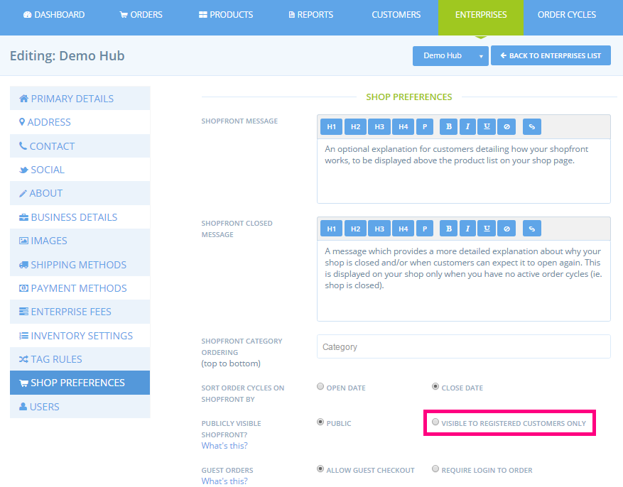

# Private shopfront

If you don’t want your shopfront to be visible to the public, or for anybody to be able to place an order with you, there are two ways that you can make your shop more private.

## 1\) Make the shop invisible

In your [Enterprise Settings](../../basic-features/enterprise-settings.md), under Primary Details, you can set your profile to 'invisible'. When you are invisible your profile will not show on the OFN map and directories. Further, you shop will not show on the OFN Shops directory. The only way that people will be able to navigate to your shop is if you provide them with the URL.

This can be a simple way to limit the number of new visitors who see, and place an order in your shop.


 A disadvantage to this approach is that you're no longer visible in the OFN directory, making you less visible in the local fair food movement. 


## 2\) Visible to registered customers only

A stricter, but more time consuming approach is to set your shop to be only visible to your known customers. This feature is useful for those operating membership based coops, or wholesale shops. When you opt to have a private shopfront, you'll need to maintain your [customer list](customers.md) to control which users can access your shop. Only customers whose email is on your Customer list will be able to login and view your shop and place an order. Any new customers who want to shop with you will need to first contact you, and then you'll need to manually add them to your customer list.

You can make your shop private by going to your **Enterprise settings &gt; Shop Preferences** and select ‘**visible to registered customers only**‘.

You'll need to maintain your [**Customer** ](customers.md)list to control which users can access your shop.

Your customer list will already include all customers who have previously placed an order in your shop. You can also add customers manually before they have shopped with you by clicking **+ New Customer**. Then in future, if they come to shop with you, they can login and will be permitted.

You can also delete customers who you no longer want to be able to see your shop.

### How does the shopping experience change when your shop is private?

When visitors to your shop arrive at the shop, if they're not logged in yet, they'll see the message below.

From here there's 2 pathways:

a\) If the customer logs in, or signs up with an email address that is on the shop's customer list, they'll be taken to the shopfront as usual.

b\) If the customer logs in or signs up with an email that is not on the shop's customer list they'll see the message below. They can then contact the shop to request access.

