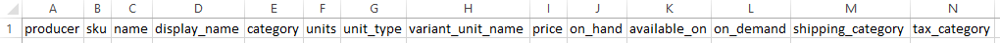

# Subscriptions - the customer's perspective

This page details what a customer with a subscription order can expect. It also highlights some things that shops offering subscriptions should be aware of.

## Setting up subscription orders for customers

At present, the shop manager must setup subscription orders for their customers, in the backed of OFN. There is no way for customers to setup their own subscription. To setup a subscription for a customer you'll need to get some information from them:

**Name**, **phone number** and preferred **email address**. As mentioned, you must add your subscription customers' emails to your [Customer List](../shop-setup/customers.md) before you can create a subscription for them. 

**Billing and shipping address**: You'll need this information when you setup their subscription.

**Products** they want to include in their subscription: You'll need this information when you setup their subscription.

**Shipping method**: You need to assign their subscription order to a shipping method.

**Payment method**: Customers can select from your manual payment methods \(e.g. cash, bank transfer\), or paying with their credit card through your shop's stripe account. In the case that you are offering automated direct debiting to credit cards using stripe, you will need your customers to add their credit card information into their OFN account \(see below\).

**Dates** they want their subscription to span: Remember, for a subscription order to be created for a given order cycle it must have a start date either before or after the order cycle opening date, and the subscription end date must be after the OC close date.

CAN A SHOP ADD AN UNCONFIRMED CUSTOMER ACCOUNT TO SUBS, AND CAN THAT CUSTOMER RECEIVE SUB ORDERS WHILE UNCONFIRMED? YES THEY CAN.

## Storing credit cards

Customer who want to pay for their subscription orders via automated direct debit onto their credit card need to save their preferred card in their OFN account. Only after they have done this will the shop be able to setup a subscription which charges their credit card.

## Email notifications

The subscriptions feature includes a number of automatically generated emails which are sent to customers each time one of their subscription orders is processed.

### Email 1 - When the Order Cycle opens

The first email is triggered the moment an order cycle in the customer's subscribed schedule opens. This email lets the customer know that their subscription order has been opened. The customer can see which items are in the order and the amount they'll be charged. The email also contains their shipping and payment information.

Whether or not a customer can make changes to their subscription order will depend on the shop's settings in [Shop Preferences](../../basic-features/enterprise-settings.md#shop-preferences).

If the shop **does not all customers to change their orders,** their email will be the same as above. If they wish to cancel their order, or make changes, they'll need to contact the shop to request the changes.

If the shop **allows customers to change their orders**, the text in the blue text box will be slightly different to the email above and there will be a link which will take customers to their order \(see below\). 

Currently customers will only be able to remove items from their order, or change the quantities of existing items. If they want to add a new item to their order they'll need to either place a new order or contact the shop and ask them to make this change for them.

### Email 2 - When the Order Cycle closes

## Frequently asked questions from customers

### What happens if an item in my subscription isn't available?

If a product in a customer's subscription isn't available in a given order cycle, they'll be alerted in their email notifications \(see example below\).

### How can I pause my subscription?

If you need to pause your subscription you'll need to contact the shop and ask them to pause it. Be sure to let them know which period you want to resume your subscription for.

### Will the price of my subscription remain the same, even if prices change in the shop?

No, if product prices change after you setup your subscription order, you wil be charged according to the updated prices.

### How can I cancel my whole subscription?

If a customer wants to stop their subscription, they'll need to contact the shop manager and let them know.

### How can I cancel a single order of my subscription?

If a customer wants to stop their subscription, there are two ways to do this depending on the shop's settings. 

If the shop __**does not** allow customers to make changes to their orders, they will need to contact the shop and let them know which order to cancel. 

If the shop **does** allow customer to make changes to their orders, the customer can wait until they receive the first confirmation email \(when the OC opens\) and from there they can edit their order and cancel it.

