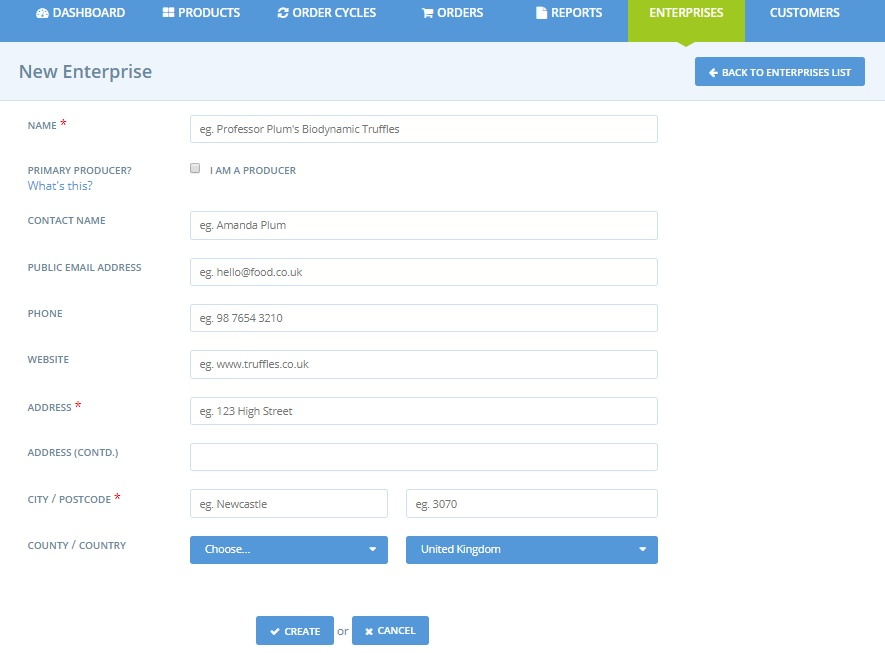

# Create or connect with your supplying producers


 This page is relevant for users who have registered **Producer or Non-Producer Hub** enterprises only.


For such Hub enterprises, connecting with existing OFN producers or creating accounts for your producers is a necessary precursor to adding your product range to your shop.


All producers supplying / selling products on the Open Food Network must have an enterprise account on the platform. The products are entered in the producer's catalog and then "displayed" \(with potentially different prices and stocks\) on the shopfront of the producer and/or shopfronts of other distributors to whom the producer has given [permission](enterprise-to-enterprise-permissions-e2es.md). This is an important feature on the OFN, as it enables customers to trace the origin of products.


An example of how this displays in the shopfront is shown below:

As a hub, before being able to add products to your shopfront, you have two options: 

1. Create OFN profiles for the producers who supply you \(if they don't already have a profile\)
2. Request [permission](enterprise-to-enterprise-permissions-e2es.md) to sell the products of existing OFN-registered producers.

If you are not sure if your supplier already has an OFN profile then you can find out by going to the main 'Producers' menu and searching.

## Supplier does NOT have an OFN profile.

If a supplier does not have an OFN profile you can create one on their behalf. You’ll be the ‘owner’ of this profile and be able to add the producer’s products, with their prices and on hand quantities, and then list them in your shop. The new producer enterprise will be visible on your dashboard when you login to your existing account. Should the producer ever wish to take ownership of their profile, [ownership can be easily transferred](transfer-ownership.md). If the producer wants to manage their profile and catalog but is happy with you being the owner of their profile, you can [invite them as managers](enterprise-settings.md#users).

### Things to consider before creating a producer profile:

Before creating a profile for your suppliers you should contact them and let them know that you are creating an account and enterprise for them on the OFN. They may wish to be involved in the process and even take some responsibility for managing the profile and their products etc. But most commonly producers will prefer that hubs own and manage their profiles for them.

Be sure to ask the producer what information they would like shared on their profile. You can often take text and images from their existing websites or social media sites, however you should always ask permission before using any of their content. Once you have their information in front of you, a profile should take you no more than 10 minutes to create.


By default you can create up to **5 enterprise profiles** on the platform. This is a spam prevention method, but once we know you aren’t a robot, we’ll give you permission to make extra enterprise profiles. If you need to create more [contact your local OFN entity](https://www.openfoodnetwork.org/find-your-local-open-food-network/).


### Creating a producer profile:

You can create a new profile for a producer by clicking on **Enterprises** in the horizontal blue banner, and then clicking **+ New Enterprise**. Remember ‘enterprise’ is a general term used for any producer or hub profile on the OFN.

This will take you to this page:

A few things to note:

**Name:** Enter the name of the producer farm/enterprise. If you get an error message saying that this name has already been taken, it means that there is already a profile for this producer. Therefore you can jump to [Supplier has a pre-existing OFN profile](create-or-connect-with-your-supplying-producers.md#supplyingproducer).

**Primary Producer:** Select this box, as you are adding an enterprise which makes/grows food which you will retail for them on your hub shop front.

**Email and Phone:** This email and phone number will be visible on the profile. If this producer does not wish to be contacted by the public, then place your hub’s contact details here.

Then you can access the the same [enterprise setting page](enterprise-settings.md) as described before. Some recommendations :

**Visible in Search:** You should discuss with the producer whether or not they wish to be visible on the OFN. If they wish to be invisible, their name and profile will still be shown next to their products in your shop, but they will not be searchable on the map or front-page lists.

**About Us:** Remember the OFN is all about putting transparency into the food system and customers are increasingly interested in where their food has come from. Therefore, it pays to add plenty of details about your producers and what makes them unique.

**Images:** We strongly recommend that all profiles have both logo and promo images. These images make the online experience for customers more enjoyable and engaging, and also lend credibility to the enterprises.

## Supplier has a pre-existing OFN profile 

If a supplier already has an OFN profile, you will need to get their permission to add products to their profile \(if they haven’t already\) and to stock them in your shop. You will be able to find their contact details on their OFN profile. 

Keep in mind that they may be registered as a Producer Profile but have their products and enterprise managed by another Hub. OFN can accommodate two \(or more\) hubs stocking the same producer’s products on their separate shop fronts, through the [inventory](../products-1/inventory-tool.md) feature for instance. If hubs **work together and notify each other** of any changes they make to producer enterprises which they manage, but that supply multiple hubs, then distribution problems can be avoided.

Within the OFN, [Enterprise to Enterprise Permissions \(E2E\)](enterprise-to-enterprise-permissions-e2es.md) are used to control the nature of trading agreements between producers and hubs. Producers can grant hubs different kinds of E2E permissions, in different combinations, to specify exactly which elements of their account the hub can interact with. At the simplest level a producer can grant a hub permission to stock their products in the hub’s shop. They may also be happy to allow the hub to create and modify their products, or edit their profile.

[This page](enterprise-to-enterprise-permissions-e2es.md) covers all of the details of the different E2E permissions available and how the producer can grant them to a hub. Discuss with the producer who is going to supply your hub with goods which permissions you require. 

