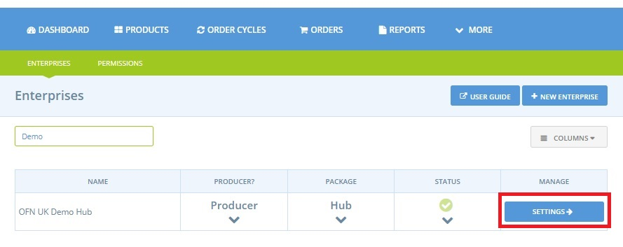
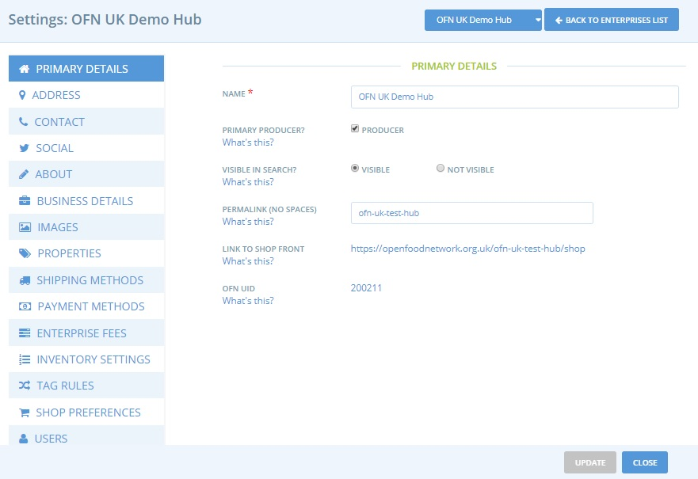
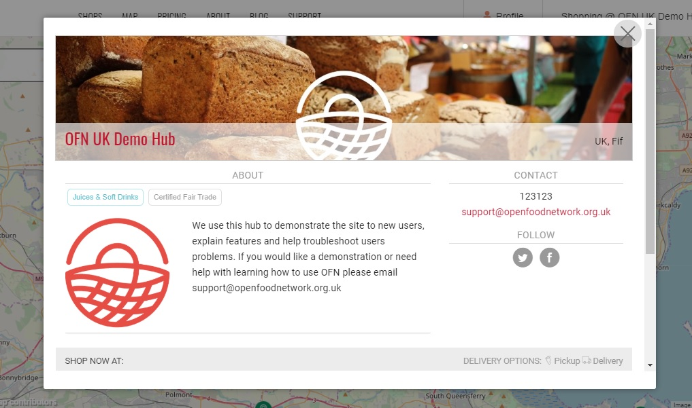
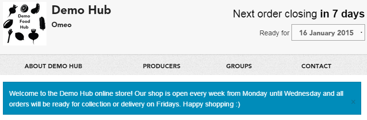

# Enterprise Settings

## Access your Enterprise Settings

1. Once logged in, and accessing your admin dashboard, select "Enterprises" on the blue horizontal menu
2. Select 'Settings' next to your enterprise


To save a change of profile type, do not forget to click on "save" at the bottom of the window on the right.


You will then access a menu with multiple options. The exact options available varies between Enterprise type. This is example is for a Hub:


To save your changes, you must click "update" at the bottom of the page. It is recommended to save each page before changing pages.


## Primary Details

**Name:** This is the name of your enterprise. It will be the title of your profile \(and shop\).

**Primary Producer:** Select the producer box if you are a producer.


Only enterprises marked as Producers can add products to OFN. [Non-Producer Hubs](package-types.md#for-non-producers-hubs) only need to select this option if they retail mixed boxes which they pack and contain items from multiple producers.


**Visible in Search:** If your profile is ready to go public, select 'visible', and your business will appear in the OFN's directory and map. If you’re still making adjustments, select 'not visible', until you are ready.

**Permalink:** You can customise part of the web address which will host to your shop.

**Link to Shop Front:** This is the web address of your shop on the OFN \(if you've chosen a profile type with shopfront\). You can customise part of the URL above.

**OFN ID:** This identifier makes it possible to recognize without ambiguity your enterprise even if you decide to change its name for example, and simplifies the work of the support team if necessary.

### Address

This information is used to geolocate your enterprise the OFN map. Your exact address won't show if you are only registered as a Producer or Non-Producer Profile.  However if you are registered as a Shop or Hub your address will show in text form in your shop front's contact details tab.

### Contact

**Contact Name:** We ask for a contact name for the OFN’s records. This name will not be displayed on your profile, but will be included in order confirmation emails if you're running a shop.

**Email, Phone & Website:** These contact points will be listed on your OFN profile and shopfront, as a means for others to make contact with you.

### Social

**Facebook, Instagram, LinkedIn, Twitter:** Links to these pages will be created on your profile and shopfront.

### About

**Short description:** This will be displayed when your profile is viewed in the list. It should be under 1-2 sentences which briefly describe what you do.

**About Us:** This is a longer description of your enterprise. It will be shown when your profile is viewed in full. It should be half to one page long.

### Business Details


These differ from country to country and they depend on local regulations and laws.




















**Siret:** This information will not be public. It is important for shop owners when they want to issue invoices from the platform.

**N° intra-Community VAT:** This information will not be public. 

**In VAT scheme?** If you are within the VAT scheme, select "yes".

**Display the logo on the invoice:** You can choose to display or not the logo of your enterprise on the invoices issued from the platform.

**Add a specific mention at the bottom of the invoices:** You can add a specific mention that you would have the obligation or the wish to add on your invoices.



**Company Number:** For businesses registered at Companies House this is your unique identifying number.

**Charity Number:** If your enterprise is a registered charity

**Charges VAT:** VAT registered businesses should select this option so that VAT is managed appropriately on invoices and reports.

**Display Logo on Invoices:** if desired.

**Add Customised Text at the end of Invoices:** such as payment details \(if payments are accepted by BACS\) or terms and conditions.



**ABN:** this will not be displayed publicly. It is required for shop users who want to print invoices.

**ACN:** this will not be displayed publicly.

**Charge GST?**– If you wish to charge GST for your products select ‘yes’.



### Images

**Logo image:** This will be visible when your profile is viewed in brief, as a pop up window. It will also show on your profile. This image must be square \(i.e. 100 x 100\), or it will be cropped/warped. 

**Promo image:** This image will run horizontally along the top of your profile page. It should be 1200 x 260 pixels in size.

An example profile is shown below in its complete version \(from the map or shopfront pages\).

And now in its condensed version \(from the producer listing page\).

### Properties 


Visible to **Producers** only


You can add properties \(such as free range or certified organic\) to your enterprise. These properties will then be automatically applied to **all** of your products. 

You can also specify properties for particular products only. This is useful if you stock both certified organic and ordinary groceries, for example. More information about this can be found [here](../products-1/product-properties.md). 

### Shipping Methods, Payment Methods & Enterprise Fees


Visible to Shops or Hubs registered enterprises only \(ie invisible for Producer/Non-Producer Profiles\)


The [Shipping Methods](../shopfront/shipping-methods.md), [Payment Methods](../shopfront/payment-methods.md) and [Enterprise Fees](../shopfront/enterprise-fees.md) are covered in greater detail in later chapters in this user manual.


At least one method of **payment** and **delivery** must be setup to be able to open your online shopfront.


### Inventory Settings


Visible to Shop and Hub registered enterprises only.


For most enterprises the recommended setting can be used.

Advanced users who need greater flexibility with product management should consult the [Inventory](../products-1/inventory-tool.md) page of this guide before changing the settings.

### Tag Rules


Visible to Shop and Hub registered enterprises only.


Under this menu are all the 'tags' which have been assigned to the customers of your enterprise.

'Tags' are labels you apply to customers, products and other settings to assign differential access, pricing or other benefits to specific groups.  They are particularly useful if you wish to charge loyal customers or 'members' of your food hub preferential prices or allow them to pay by BACS rather than PayPal/Stripe.

 For more information, visit the ['customer management and conditional displays/prices' section](../shopfront/customer-management-and-conditional-displays-prices/).

### Shop Preferences


Visible to Shop and Hub registered enterprises only.


**Shopfront Message**: This message is optional. It will be displayed at the top of your online store, above the product listings. It’s an opportunity to provide basic information to the customer about how your store works. For example, you may explain how your order cycles are structured, or any membership requirements. It could also be a friendly greeting, or a chance to promote specials. An example is below:

**Shopfront Closed Message**: This message will be displayed when your shopfront is closed \(no active order cycle\). It’s a chance to tell customers about how your ordering works, and when the shop will next be open and accepting orders.

**Shopfront Category Ordering**: By default, products are arranged alphabetically in your shop. You can choose to display the products in order of category according to your wish. In this case, the products will be displayed in order of category and then in alphabetical order within their category. E.g. you may wish to have your Meat & Fish products to appear at the top, with your less important Pickles & Preserves appearing further down the shopfront.

**Sort order cycles on shopfront by:** If your shopfront has [more than one order cycle open at the same time](../shopfront/order-cycle/opening-more-than-one-order-cycle.md) you can select the order in which they appear on the shopfront. You may opt to sort them by closing date \(closing soonest first\) or by opening date \(opening soonest first\).

**Publicly visible shopfront?** If you select ‘public’, any shopper will be able to access your shopfront and place an order. If you select ‘visible to registered customers only’, shoppers who come to your shop will be prompted to login and only those users who are on your customers list will be given access to your shop. Learn more about the [private shop feature](../shopfront/private-shopfront.md).

**Guest Orders?** If you select ‘allow guest checkout’ shoppers won’t need to login to the OFN to shop with you, so they don't need to sign up and have a user account. If you want the extra security of knowing your customers must have an OFN account in order to have placed an order then select "require login to order". 

In order for a customer to have an OFN account they must have confirmed the email sent to them when registering with us.  Thus, by selected "require login to order" it may help limit the number of orders placed that are subsequently never collected as you know that the customer's order confirmation email will be sent to an active email account.


The 'Guest orders' setting is not applicable if you have opted for 'visible to registered customers only'.


### Users

**Owner:** This is the email of the primary user responsible for this enterprise. They have the power to change all aspects of the profile. Only the owner can change the owner, choosing among the enterprise managers list. This user will have a star next to their name in the managers' field.

**Notifications:** This is the email of the user to whom the OFN system correspondence will be directed, i.e. order confirmations etc. Only the owner can nominate the user who will receive the notifications, among the enterprise managers list. This user will have an envelope symbol next to their name in the managers' field.

**Managers:** Other OFN users who have been granted permission to manage this account. Want to add a new manager? You can search for existing emails of users who have registered for an OFN account and add them as managers. If you don't find any user for the email you are looking for, the user doesn't exist yet on the OFN, you need to invite them \(see next point\).

**Invite manager:** This is for adding a manager who is not registered with OFN. When you add them, they'll be sent an email confirmation and when they confirm their email they'll be able to set a password, and login to administer this enterprise.

