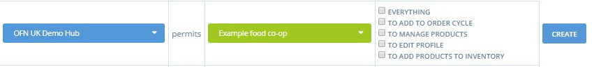
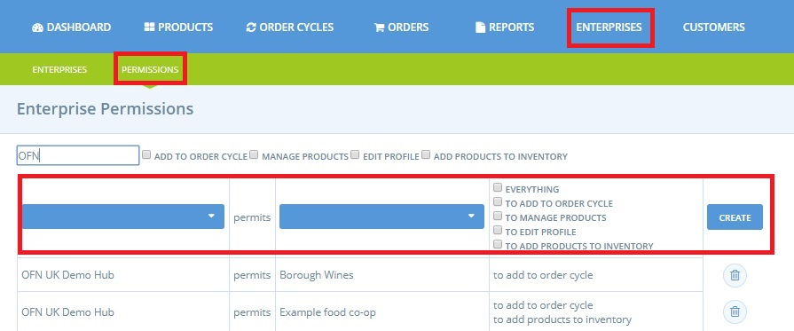

# Enterprise Permissions

## Enterprise Permissions 

Within the OFN Enterprise Permissions are rules which govern the trading relationships between businesses: suppliers and distributors. These rules must be set up before one company \(Producer Profile or Producer Shop\) can become a supplier of another \(Hub\), or vice versa. A permission \(or 'right'\) is granted by one company to another regarding access / modification of products and profile. This page details the different permissions and how to allocate them. 

To access your enterprise permissions:

Lastly, we explore this topic from the point of view of:

* [a Hub](enterprise-to-enterprise-permissions-e2es.md#hub-perspective) \(the distributor\)
* [a producer profile or shop](enterprise-to-enterprise-permissions-e2es.md#producers-perspective) \(the supplier\)

## The Four Permissions

There are 4 different types of Enterprise permissions. They can combine in different ways to give companies more or less rights according to their profiles.

**Permission to add to order cycle**: the supplier \(producer\) allows the distributor \(an OFN Hub\) to add products to the latter's order cycles.  Thus, products from the supplier can appear on the hub's shopfront.

**Permission to manage products**: the supplier authorises another OFN registered enterprise \(typically a hub\) to create, delete and modify products directly in its supplier catalog. 


This can potentially impact all hubs which the producer supplies with goods through OFN.


> _For example, if Farmer Jo supplies potatoes to Hubs A and B but grants Hub A permission to manage its products then if Hub A changes the price of the potatoes then this price change \(under standard settings\) will be reflected on the shop fronts of both hubs A and B._

**Permission to edit profile:** one company allows another to modify details in their [Enterprise Profile](./) \(contact details, address, description, ...\).

**Permission to add products to inventory**: the supplier \(producer\) authorises the distributor \(hub\) to add its products to the shop catalog \(or '[Inventory](../products-1/inventory-tool.md)'\) of the hub.


If a producer supplies more than one hub with goods, then to allow each of these hubs to manage pricing and stock levels of their products independently we recommend adding this permission between the two enterprises and for the Hubs to change their [Inventory settings](enterprise-settings.md#inventory-settings).


## Granting and Managing Permissions

To modify, add or delete permissions, go to the admin dashboard and then to  'Enterprises' on the blue menu and 'Permissions' on the green sub-menu. 

To give permission:

* Select your enterprise from the drop down menu in the first column \(you are a producer who supplies others\)
* Select the name of the enterprise \(hub\) you wish to supply from the the second column.
* Tick the permissions you wish to grant the distributor of your goods \(hub\) or to grant multiple permissions select 'everything'.
* Click on 'Create'.

 Note that you can delete or change these permissions at any time.


Only users listed as [Managers](enterprise-settings.md#users) of an enterprise can change its permissions.


If you need another enterprise to give you permissions, you need to contact them by email or phone. There is no online feature to do this.

## Automatically Generated Permissions

When a user is the main manager of several enterprises on the platform, [the four permissions](enterprise-to-enterprise-permissions-e2es.md#the-four-permissions) are created automatically between each enterprise. This is not the case when enterprises are managed by different users.

## Hub perspective

The following common scenarios demonstrate enterprise-enterprise permissions you may need to set up for your hub.

> **I have** [**created Producer Profiles for each of my suppliers**](create-or-connect-with-your-supplying-producers.md#supplier-does-not-have-an-ofn-profile)**. Which permissions do I need to set up before I can stock their products on my Hub shopfront?**

The system is configured so that hubs creating producer profiles will have the _correct permissions installed as default_, so that they can start adding products and trading with these producer profiles right away.

> **My** [**supplier already has an enterprise registered with OFN**](create-or-connect-with-your-supplying-producers.md#supplyingproducer)**. I would like to add their products to my hub shopfront.**

You must contact your supplier in person. Their contact details \(phone number, address and email address\) will be located in their OFN profile.  

If you only intend to _**stock their products**_ and don't wish to help them manage the rest of their OFN profile then ask the producer to grant permission _**to add to order cycle**_ and permission _**to add to inventory.**_ 

If the supplier wishes for you, as a Hub manager, to help them organise their OFN enterprise then they may grant you all four permissions.  Should this occur then you will be able to edit their profile and manage their products.

> **My Hub distributes through buying groups. Which permissions will the buying group need with my hub and my producers?**


This is an example of where the hub managing \(co-ordinating\) an order cycle differs from the enterprise from which customers collect their purchases.

_If Hub A manages \(co-ordinates\) an order cycle for a buying group \(Hub B\) then the order cycle will be displayed on Hub B's OFN shopfront._


The buying group \(Hub B above\) will need to grant the order cycle co-ordinator \(Hub A above\) permission to add to order cycle \(and ideally permission to add to inventory\).

Producers who supply Hub A with products that are to also be sold by the buying group \(Hub B\) must grant both Hubs A and B permission to add to order cycle \(and ideally permission to add to inventory\).

## Producer's perspective

When a producer wants to start selling their products through other enterprises \(hubs or buying groups\) the must establish the appropriate enterprise-to-enterprise permissions. There are different levels of permission that a producer can grant, depending on how much power they want to give the hub to manage their products and profile \(see [top of page](enterprise-to-enterprise-permissions-e2es.md#the-four-permissions)\).

These examples explore some common scenarios.

> **I am a producer and would like a local OFN hub to stock and sell my products.**

**Essential:** For the hub to add your products to their shopfront, you’ll need to grant them _'permission to add to order cycle'_.

**Optional:** You might also want to give the hub permission to manage your products, to edit your profile or to add to Inventory.

> **A hub that I supply distributes through buying groups.**

In order for your products to be distributed by the buying groups you will have to add a minimum of permission 'to add to order cycle' for the buying group enterprise _as well as_ the hub you supply directly.

> **I am a Producer Shop who supplies a local Hub as well as running my own shopfront.  The hub would like to manage the stock levels and prices of my products.  I would like to** _**also**_ **manage stock levels and prices of my products.**

This scenario can be solved by granting the hub permission to add to Inventory as well as permission to add to order cycle.

This allows the hub to stock your products in their shop, but to set their own prices and inventory levels. When you stock your own shop with your products, they will continue to reflect the prices and stock levels that you have set.

