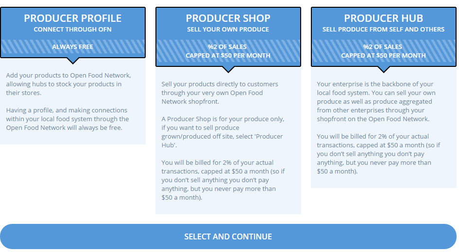
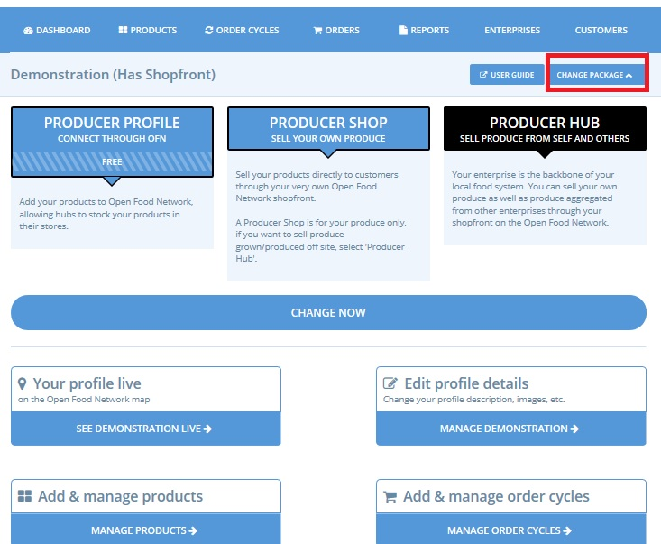

# Package / profile types

When you first log in to the admin dashboard, you will need to choose the OFN profile which [best matches your business model](../../your-quick-start-on-ofn-given-who-you-are.md). **Without this step, your enterprise account will not be created and, hence, your enterprise will remain invisible on our map.** To access the admin dashboard, login and then click on "Profile &gt; Administration" at the top right:

Once in the admin dashboard, you are prompted to choose a profile type for the enterprise you have created. Based on this choice, menus that help you refine your profile and access the features you need will be made available on your [enterprise settings page](enterprise-settings.md).


Be careful, the process will be slightly different if you are creating your second, third, fourth... enterprise.  This process applies for first enterprise created by a user only!


Open Food Network offers three types of enterprise profiles that will differ depending on whether you are a producer or not, and whether or not you want to open an online shop to sell on the Open Food Network. The profiles types vary a little bit depending on if you are are a producer or not, so we describe them below under two main sections: the profiles for producers and then the profiles for distributors \(or "hubs" in the Open Food Network world :-\)\).

## For Producers

There are three types of profiles for producers:



With this option not only will your enterprise will be visible on the OFN map and to customers searching our platform, but you will be able to manage a product catalog. Your products can be distributed and sold through other enterprises which are part of the OFN network. 

As a 'Producer Profile' you will not be able to manage your own online shop front. For more information on the quick setup guide for this type of profile, [click here](../../quick-start-guides/).


If you'd like to retail your products on an existing online sales platform and just use OFN to increase your visibility then the 'Producer Profile' package is for you!

You can put the link to your online shop in your enterprise description.




#### You would like to sell only your own products on OFN

This option allows you to run a shopfront which retails only those products in your own catalog. Note that 'Producer Shops' can conduct sales through their own shopfront and/or act as a supplier to other shopfronts \(hubs\). 

For more information on the quick setup guide for this type of profile, click [here](../../quick-start-guides/).



#### You would like to sell your products as well as those of other producers / suppliers 

This option allows you to manage a shop which retails both products made by yourself and those made by other local producers.  You can retail products from any Producer who has given you [permission](create-or-connect-with-your-supplying-producers.md) to do so. 

 For more information on the quick setup guide for this type of profile, click [here](../../quick-start-guides/).



## For Non-Producers \(Hubs\)

Two types of profiles are available to non-producers \(distributors / hubs\):



With this option your enterprise will be visible on the OFN map and to customers searching our platform. 

For more information on the quick setup guide for this type of profile, click [here](../../quick-start-guides/).


If you'd like to retail products made by a collection of producers on an existing online sales platform and just use OFN to increase your visibility then the 'Non-Producer Profile' package is for you!

You can put the link to your online shop in your enterprise description.




#### You would like to create an online shop

This option allows you to manage a shop which retails products made by others. You can retail products from any Producer who has given you [permission](create-or-connect-with-your-supplying-producers.md) to do so. 

 For more information on the quick setup guide for this type of profile, [click here](../../quick-start-guides/multi-producers-shop-hub-quick-setup-guide.md).



## Changing your profile type

You can change your profile type \(package\) at any time in the future. This can be done by clicking the ‘**Change package**‘ button on the [dashboard](../dashboard.md). 

Or you can change your producer/non producer status and package in the '**Enterprise'** menu on the blue horizontal banner, and then editing your enterprise’s settings \(see below\).

## Next step

Once you have chosen the correct profile type for your food business you can complete any missing information and further refine your setup under the [Enterprise Settings](enterprise-settings.md) menu. 

