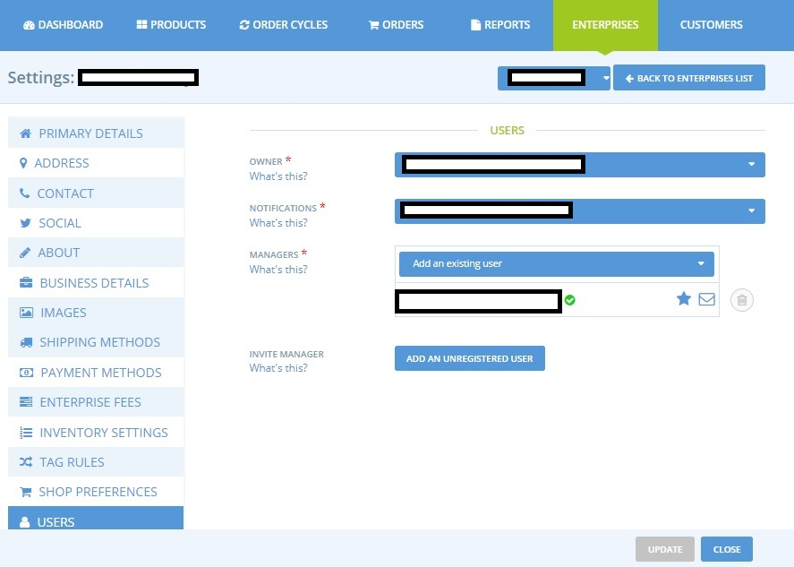

# Change Profile Managers / Owners

It is common for a producer's profile to be created by a hub, and then the hub will add the producer as a manager of that profile, or even transfer the "ownership" \(primary manager\) of the profile to the producer, when the producer accepts to manage their profile and product catalog themself. 

To add a new manager and eventually transfer ownership, here is the procedure to follow: 

* On the admin dashboard, go to the Managers menu of your Enterprise settings \(Enterprise &gt; Settings &gt; Managers\):

* Under "Managers", search for the email of the producer you would like to add as a manager.

**Case 1: The Producer in question already has a user account with Harvest To Order:**    
Their email will already be registered with us and so it will appear as you start to type. Select and click 'Update' \(red button, bottom right\) to save.


Warning: you must search for the exact **full** email. We recommend searching our list of users by copying and pasting the **entire** email address.


**Case 2: The Producer in question does not yet have a user account with Harvest To Order:**  
In this case, you can not find their email when you type in the box 'Add an Existing User'. You must then click on "Add an Unregistered User" just below, next to the 'Invite Manager' field.   
The producer will then receive an email from us to confirm their registration.  On following the instructions detailed in the email they will be able to complete setting up their Harvest To Order account, including adding a password.

Once the producer is a manager of the enterprise profile you created on their behalf, you can choose to name them the main manager and/or the contact to receive order notification.  At this stage, as a hub manager you may wish to remove yourself from the list of managers. 


Do not forget to click 'Update' to save your changes!



By default, a user can not be a manager / owner of **more than 5 enterprises**.   
If you receive a message stating that _the new user has reached their limit_, contact us and we will increase their business limit. 

This measure is intended to avoid the massive creation of profiles by robots, something that could blow our server and make the platform unavailable. It is a classic prevention measure.


