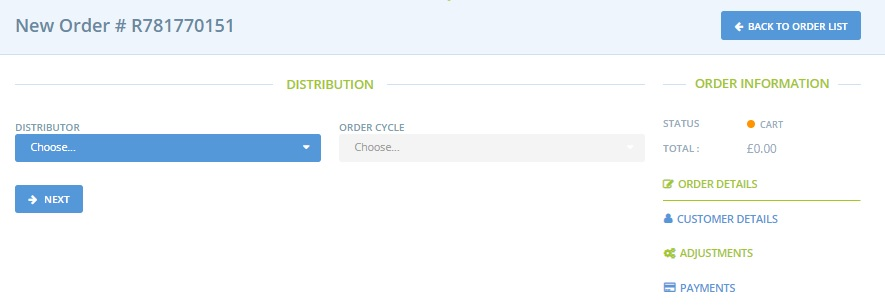
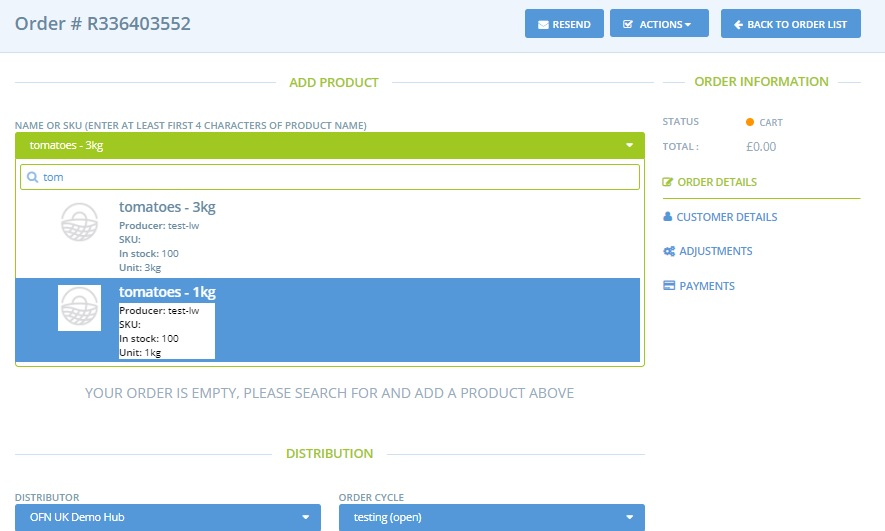

# Create orders manually

Sometimes you may wish to manually put an order into the system. This may be on behalf of a customer, or so that your reports will capture an order from a different sales stream. You can create an order by going to **Orders** and clicking on the **+ New Order** button.

There you are then lead through a step-by-step process to place the order:

Firstly you will be prompted to select the distributor that the order will be placed with.   
Next you will need to select the order cycle that you want the order to be placed in. You choice of order cycle will dictate which products will be available to be added into the order and the fees applied.  
You will then be redirected to the following page where you can select products. You must type at least the first 3 characters of the product for it to appear as an option in the drop down list:

After finding the product you'd like to order, enter the quantity and click the **+** button to the right of the product to add it to the cart.

Once a product is added you can edit \(quantity for example\) by selecting the pen and paper icon to the right of the item:

After editing any aspect of the cart, click **update and recalculate fees** to update the price.

The next step is to add in the customer’s details \(right hand menu, second option down\). If it is a customer who is on your customer list, you can select them from the dropdown menu, otherwise you can fill in the customer’s details details and check them out as a guest.

Click **Update** and go back to Order Details \(top option on right hand menu\).  You will now be able to select a shipping method for the customer.

Tick to update changes and cross to cancel.


You can not select a shipping method prior to adding the customer's details.


The final step is to add the customer’s payment method.  This is found from the bottom option of the right hand menu:

Clicking **update** will finalise this order and send an email confirmation to the customer.

