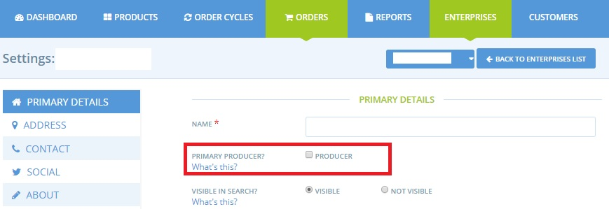

# Products

If your enterprise is a "producer" type \(you checked the corresponding box in your profile settings\), you can now [add products](products.md) and [related variants](product-variants.md) to your producer catalog. These products can be [added in bulk by importing a csv file ](product-and-inventory-import.md)\(excel file saved in csv format\).

The price entered for each product in the producer catalog is the full amount the producer will receive from a sale- hence a 'wholesale' price. Hubs \(distributors\) can add their fees for admin, transport and packing etc on top using fee options in [Shipping Methods](../shopfront/shipping-methods.md), [Payment Methods](../shopfront/payment-methods.md) or [Enterprise Fees](../shopfront/enterprise-fees.md).


If you are a Hub managing a producer's enterprise profile on their behalf we recommend you do **not** incorporate your mark up into product prices, rather use the fee methods above.  This makes the product catalog more flexible for future changes.


If a hub wishes to change the price of a producer's products without using the Enterprise, Shipping or Payment Method Fees strategy then it is best to use our [Inventory](inventory-tool.md) feature.  By adding products to their shop inventory, hubs create a second catalog, independent of the product catalogs of their suppliers. Prices and stock levels in the Hub Inventory can be altered by the Hub without impacting on producers' 'master copies'. 

For [irregularly priced products](pricing-irregular-items-kg.md), such as a **whole chicken** with a price that varies from chicken to chicken depending on weight, there is an option to set a price 'per chicken' which can then be adjusted at the time of delivery to the specific piece of meat/vegetable.

The "[Bulk Buy Option](group-buy-for-bulk-ordering.md)" page details how Buying Groups can use OFN to organise and record bulk purchases.  For example, if a group buys rice in 25 kg bags then this function can help distribute the rice between customers based on a weight range they request on purchase. 

