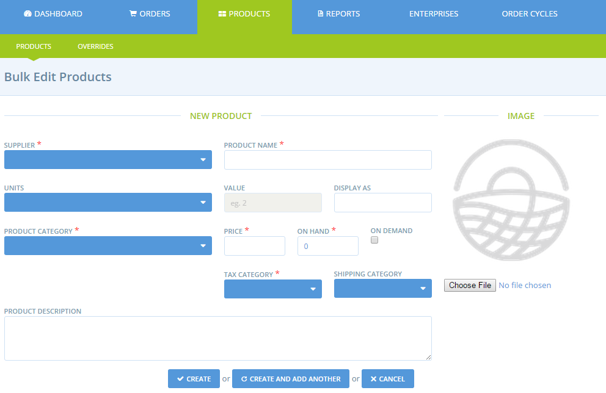

# Add products

You can either add products to your catalog one by one \(detailed below\) or by [bulk import](product-and-inventory-import.md), if you have all the relevant details in a .csv file.

## Adding products

Once logged into the Admin Dashboard, select on **Products** on the horizontal blue menu, and then click **+ New Product**.

This will take you to the New Product page.

**Supplier** 

Select the enterprise who produces and supplies the product.


If you are a producer, this will be you. If you're a hub, remember you’ll only be able to add products to producer profiles which you have created, or if you have been granted permission to manage the products of a producer profile. See [here](../enterprise-profile/create-or-connect-with-your-supplying-producers.md) for more info.


**Product name:** This is the title of the product when displayed on the shop front.

**Units:** Choose the unit the product is sold in? \(g, kg, L… or item \(bunch, bag, packet\)\)

If you choose g and then enter 1000, the product will be displayed as 1kg for the buyer. Keep in mind that some units of measurement will impact on the operation of certain [enterprise fees](../shopfront/enterprise-fees.md). 

For example, a [fixed fee by weight](../shopfront/enterprise-fees.md#fee-calculators) can only be applied to products with units of **kg**. In this case, you can enter non-integer unit numbers, such as 0.2 kg, and the product will be displayed as 200 g but will be recorded in kg on the reports and when prices are calculated.

**Value:** Enter the value of units that this product is sold in \(for example if it is sold as 100 g then enter '100' here and choose 'g' for 'units'; or if it is sold as bunches of flowers, enter '1' here and 'units= items'.

**Display As:** This field automatically shows you how the units and value fields will display, once you have filled the units and value fields. \(i.e. units = kg, value = 2, Display as = 2kg\)


Note: If you have selected ‘**items**’ as your unit, the **display as** field will change to ‘**item name’**. Fill this in with the type of item it is. \(i.e. jar, bottle, or bunch\)


**Product category:** Select the most appropriate category for this product.  Assigning a product category makes it easier for customers to locate the items they wish to buy; shoppers can filter your product list by category on your shop front.

**Price:** Enter the price for the value noted above. Note, this is the base price charged by the producer and the amount they will receive for each purchase. Mark-ups and fees \(for distribution admin etc\) are added in [Enterprise Fees](../shopfront/enterprise-fees.md), [Shipping Fees](../shopfront/shipping-methods.md#fee-calculators) and [Payment Methods](../shopfront/payment-methods.md#fee-calculators). 


If your enterprise is registered for tax or you select that this product carries tax, then the price you put here is **inclusive of Tax**. If you select that this product is tax free, the price you enter will be the tax free price.


**In Stock:** State how much/many of this product you have available and ready for sale.

Use this field if you want to track your stock levels. As customers place orders, the stock level will reduce, and when the in stock amount reaches zero, the product will no longer be visible in your shop. If you don’t want to track inventory in this way, click 'on demand'.

**Unlimited:** If you select this box, it will indicate that this product is always available. This stops the software from tracking inventory levels for products, and instead it will always show that the product is in stock.

**Image:** Upload a photo of this product.


We recommend using good quality photos, in a square \(1:1\) format, and preferably a real photo of your products rather than the standard image of the web. This makes the product more attractive to the consumer. Always take your photographs in good light.

If you use an image of the web, check that it is free of rights. 


**Tax category:** Select the applicable tax category from the drop-down list. Tax \(VAT in the UK\) depends on the nature of the product and the country in which you are retailing in.


Tax will only be collected when enterprises have selected 'charges VAT = yes' under their enterprise settings -&gt; Business Details.


**Product description:** Tell your customers a little bit about this product. You might like to include a story about the specific tomato variety, include hyperlinks to any certification it may have etc.


Don't forget to click on the "create" or "create and add new" button at the bottom of the page once all mandatory fields have been entered \(those indicated by a red asterisk\). 


A short demonstration of the steps outlined above:

When you have finished creating a product, you are redirected to the "products" page where you will find all your products:

## Listing Similar / variations of a Product 

If you are listing a product which comes in a number of different options \(say different sizes or flavours, each of which may or may not have a different price\), it is best to create a ‘variant’ for that product, rather than creating multiple, separate products.  Creating product variants is discussed fully on the [next page](product-variants.md).


Variants are useful if, for example, you sell lemons singularly as well as in 'packs' of 5. Rather than have two product listings the two options can be available for the same product.


If you would like to create a SIMILAR product then you can duplicate products by selecting the double page icon to the right of an item \(red box\). By subsequently selecting the pencil and paper icon \(green box\) the copied product can be edited and the details amended for the second item.

## Refine product attributes 

Using OFN you can add **properties or labels** to your products.  This allows customers to find your items when searching for specific criteria \(eg. certified Organic\) and highlights specific qualities your products may have. Find out more [here](product-properties.md).

For tips on how to manage sales of **"irregular" products** such as meat or large vegetables sold in units but costed by weight, please read [here](pricing-irregular-items-kg.md).

Our **Group Buy** tool enables you to manage and organise sales of products in bulk lots. Find out more [here](group-buy-for-bulk-ordering.md).

