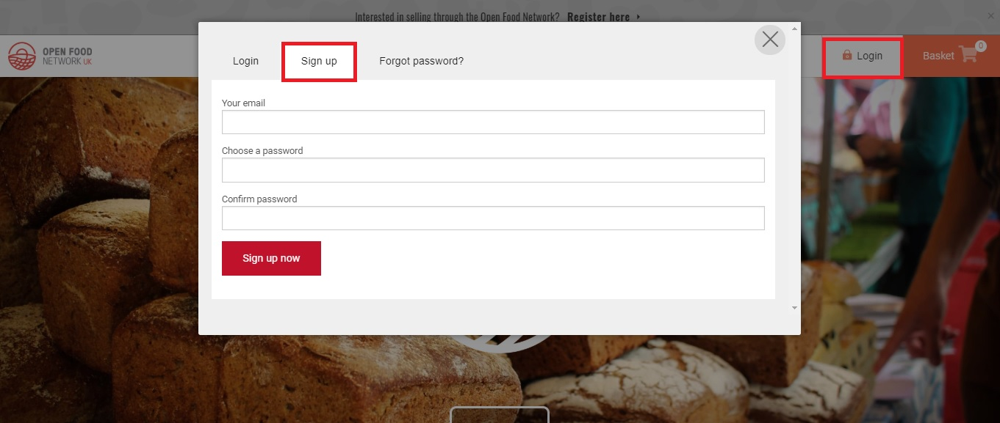
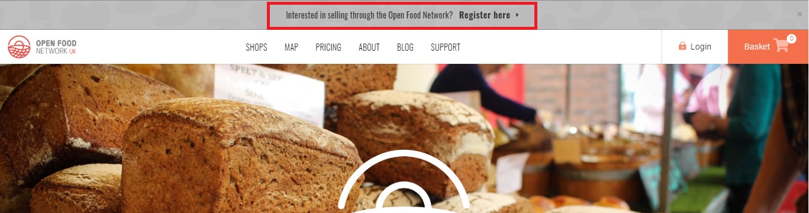
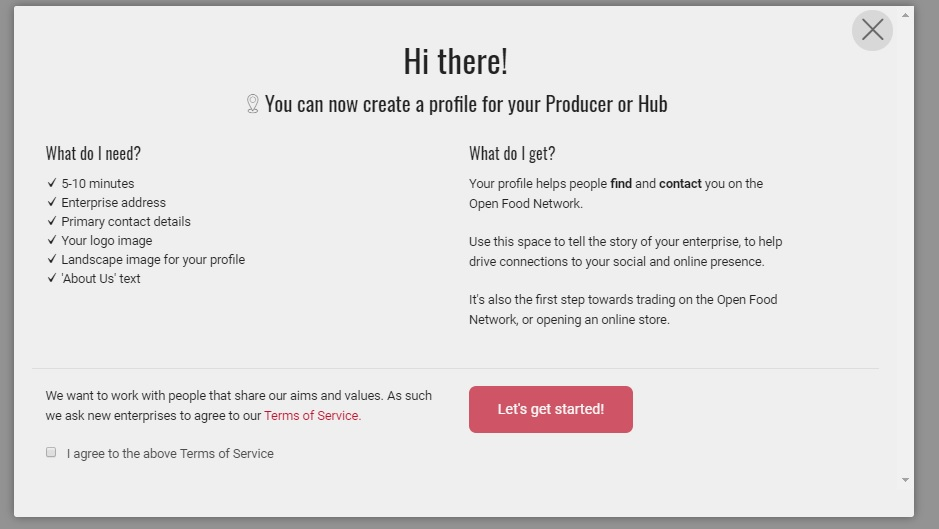
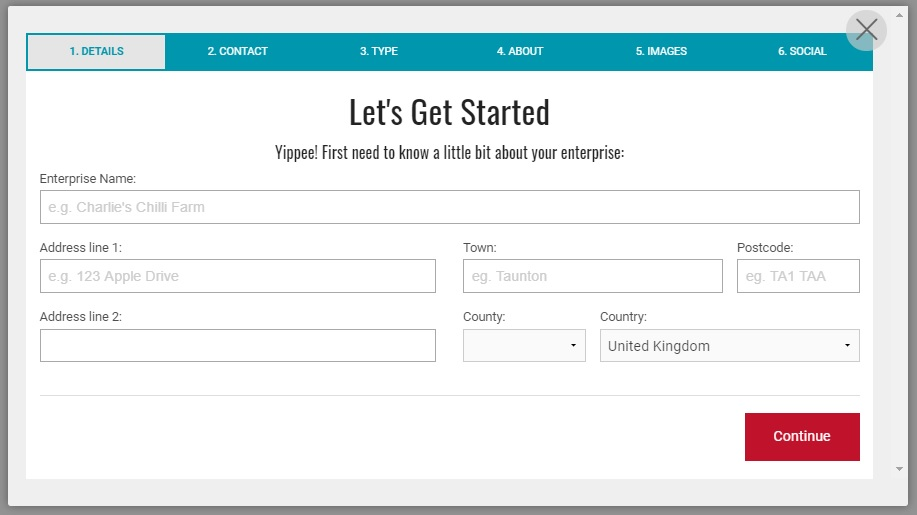
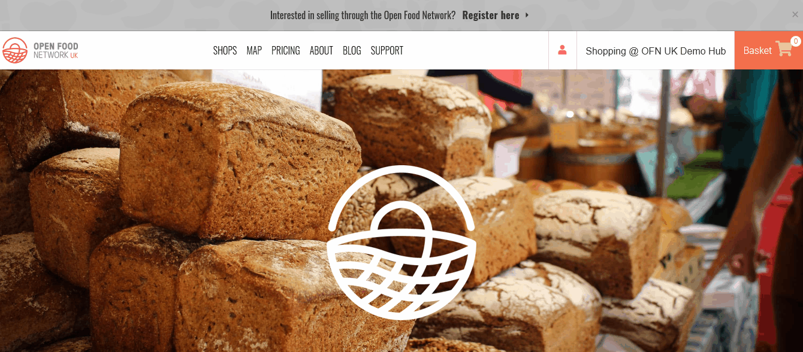

# Register and Create an Enterprise Account

### Create your user account

* From homepage, click on "Login" on the top right corner, then "Sign up" 

* Enter your email address and choose a password.
* You will receive an email in the next few minutes with a confirmation link. Click on it and you'll be redirected to the login page.  
* Login


If you don't receive an confirmation email from us promptly it may have gone to your spam/junk box.


### Create your first "enterprise" account

* Once logged in, click on the top grey banner "Interested in selling through the Open Food Network? **Register here**."

* Click the ‘I agree to the above Terms of Service’ box and select ‘Let’s Get Started!’

* Fill in your enterprise name and contact details.


Your address will be used to add your business to our map of OFN enterprises and hence increase your visibility.


* Choose between 'Producer' \(you make/bake/grow products yourself\) or 'Non Producer' \(you distribute and sell food made by others\).

* Click the ‘create profile’ button.  You'll receive an email confirming that the profile is created. You can stop here and fill in the missing information later, or continue and follow the steps to complete your profile now. 
* Fill in your enterprise description, add images, website/social media links, business details, etc.
* When you have finished, you will be redirected to the [Enterprise Profile Menu](enterprise-profile/).

**Your first "enterprise" is now created and you have started to fill in your profile, but it's not finished!** 

**The next step is to** [**choose the OFN package**](enterprise-profile/package-types.md) **\(= profile type\) which best represents your** [**business model**](../your-quick-start-on-ofn-given-who-you-are.md)**.**  

**After doing so, your enterprise will added to the OFN map!**  

**A short clip of registering your enterprise on OFN:**

### Access your Enterprise Administration Dashboard

Once you have created an Enterprise, you can manage your profile using the Dashboard. To access your Enterprise Dashboard log in to the Open Food Network and click on "Profile &gt; Administration" in the top right corner. See [Dashboard ](dashboard.md)for more information.

