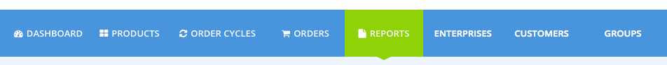
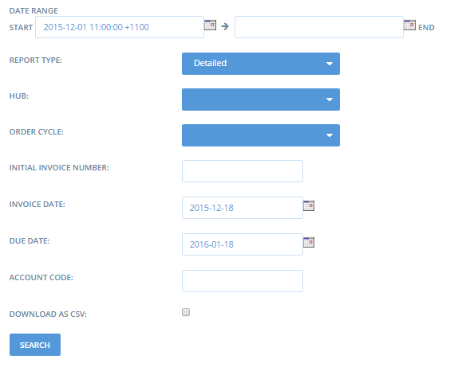
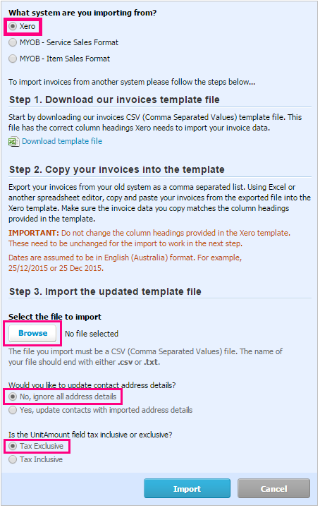

# Reports

You can access reports by clicking on **Reports** in the blue horizontal menu.  

Here you will find a list of the pre-defined data exports that are available to view and download. All reports are available to download as a CSV file by selecting the **Download as CSV** checkbox when you specify the filters for each report.   

## All Reports

## Some Helpful Reports

If you need to manage availability of products to meet orders, the [**Order** **Cycle Supplier Totals**](reports.md#order-cycle-supplier-totals) report will help support and manage the ordering process.  

If you pack and process orders on an individual or batch basis, the [**Order Cycle Customer Totals**](reports.md#order-cycle-customer-totals) report will help to guide your packing and delivery process for customers. 

The [**Mailing List**](reports.md#mailing-list-report) ****and [**Addresses**](reports.md#addresses) ****reports are helpful for managing your customer’s details. 

The [**Sales Tax**](reports.md#sales-tax) ****report is useful for enterprises dealing with GST/VAT reporting. 

The [**Bulk Co-op**](reports.md#bulk-co-op-totals-by-suppliers-report) ****report helps with bulk ordering decision making.

## Order Cycle Customer Totals

If you fulfill orders on a individual basis or prepare individual orders in bulk when your order cycle closes, the Order Cycle Customer Totals report can be used to guide your packing and delivery process for customers. The report can be filtered by order cycle or for a particular date range. If you manage multiple enterprises you can filter the reports by enterprise.

The report includes a line item for each product ordered by a customer, including the customer's **email** and **contact** details, chosen **shipping method**, the **product details** including **item cost** and **fees.** There is also a line item showing a **Total** cost for each customer for the specified order cycle or date range. This report provides all the information required to pack an order, contact the customer and arrange for delivery or collection. 

The screenshot below shows some of the information contained in an Order Cycle Customer Totals report. 

## Order Cycle Supplier Totals

The Order Cycle Supplier Totals report provides a summary of total orders that need to be fulfilled for a particular order cycle or date range. If you distribute products from one or more suppliers and need to ensure availability of products to prepare for packing and delivery, the Order Cycle Supplier Totals report will be helpful. 

In the Order Cycle Supplier Totals report, product orders are listed by supplier, with a line item for each **product** or **variant,** the **amount** of orders for each, the **unit** and **total** **costs** and details about **incoming transport**. When your order cycle closes, or when you're ready to fulfill a batch of orders, this report will shows you how much of each product you will need in stock to successfully fulfill all pending orders.

The screenshot below shows some of the information contained in an Order Cycle Supplier Totals report. 

## Mailing List Report

The mailing list report shows the names and email addresses of customers who have placed orders in your shopfront. This report can help you contact customers who have purchased items from your shopfront.  For example, you may need to notify a customer \(or set of customers\) if a product they bought is not available or if you are unable \(say, due to illness\) make the delivery schedule they requested. 

You can filter the report according to order cycle, and if you manage multiple enterprises, you can specify the shopfront \(**distributor**\) that the customer placed orders through or produce a report for each **supplier** of products that have been ordered. 

See below for an example of the Mailing List Report:

## Addresses

The Addresses report includes Customer contact details, Hub and Shipping Method, and can be filtered by Order Cycle, Shopfront \(**Distributor**\) and **Supplier.** 

## All Products and Inventory \(in stock\)

The All Products and Inventory \(in stock\) reports can be used as the basis for a paper copy ordering sheet. It lists all of your products and their prices and can be printed and used to allow customers to submit manual orders from your existing product list. 

The **All Products** report lists all of your products regardless of the in stock quantities, so it will include products that are currently listed as having zero stock. The **Inventory \(in stock\)** report shows only products which have a positive 'in stock' value.

Below is an example of the All Products Report:

## Enterprise Fee Summary

Enterprises can set up [Enterprise Fees](shopfront/enterprise-fees.md) to identify and control allocation of costs / prices for different purposes. These fees enable price transparency to customers when they visit your shopfront. The Enterprise Fee Summary report is used to summarise the amounts of fees that were charged, and to whom. 

The report can be filtered by Shopfront \(**Hub**\), **Producer** and **Order** **Cycle**, as well as Fee Names and Shipping and Payment methods.

**Example 1**: a Shop includes a 2% fundraising fee on every order. They can use the Enterprise Fee Summary report to identify the total funds raised within a particular order cycle. 

**Example 2**: a Hub charges a transport fee which they pay to a Producer for picking up produce from other farmers and bringing it into the Hub. This fee is calculated as a percentage on every product in the order cycle. They can use the Enterprise Fee Summary report to calculate how much to pay that Producer for transport in each Order Cycle.

**Example 3:** a Hub includes a fee to show customers the amount they pay to Open Food Network for their use of the platform. This fee is calculated as a percentage of all orders placed. The below screenshot is an example of this scenario:

## Packing Reports

Some enterprises use their order confirmation emails as packing sheets, or download and modify the Order Cycle Customer Totals report to suit their specific needs. The two Packing Reports offer additional options for managing the packing process.

**Pack by Customer** 

This report lists each customer who placed an order and shows each item ordered by the customer, including the quantities of each item. It’s useful for shops who pack orders customer by customer.

**Pack by supplier**

This report lists each supplier and their products. Next to each product is the name of the customers who ordered the product, and the quantity they ordered. The report is useful for shops who pack orders according to supplier.

## Sales Tax

This report is useful to separate the tax component of Sales, Delivery and fees.

## Xero Invoices

This report creates CSV files which can be imported into the accounting package ‘Xero’ to generate invoices for customers.

### Generating the report

**Date range:** You can filter orders by the date the order was placed.

**Report type:** You can select to download a ‘detailed’ report, which includes a line item for each item the customer purchased, including any fees and adjustments to their order.

**Hub and order cycle:** You can specify which Hub and Order Cycle, the orders were placed through.

**Initial invoice number:** To ensure compatibility with your Xero invoice numbering system, enter the first invoice number you would like new invoices to be allocated. All subsequent invoices will be numbered from this point.

**Invoice date:** You can select the date that you want the invoices to be marked with in Xero. This is editable once you have the invoice in Xero, but doing it here allows you to batch date all the invoices in a single report. 

**Due date:** You can select the due date to be marked on Xero invoices. Again this is editable in Xero.

**Account code:** If you place a Xero account code here, all items in the invoice will be assigned to this account. This it editable in Xero.

**Download as CSV:** When you are ready to download the file for import check the box and click **search**.

### Importing the report into Xero

In Xero go to **Accounts**, **Sales** and click Import.

Next you will select your downloaded OFN Xero report for upload. The settings you should select are shown below.

Selecting **Ignore contact address detail**s will ensure your Xero customer data is unaltered. 

Selecting **Tax Exclusive** will ensure that products you have set to include tax in the Open Food Network will include tax, but your tax free items will remain tax free.

## Bulk Co-op Totals By Suppliers Report

This report tells shop managers whether they have reached their bulk ordering threshold, and by how much they have exceeded or fallen short of this amount. Note you need to setup bulk sizes for your products before using this feature, see the [Group Buy - For Bulk Ordering](products-1/group-buy-for-bulk-ordering.md) Feature for instructions.

This report will show the following information:

* Did customers order enough of a product to justify ordering the bulk size from the supplier?
* How much extra product are customers willing to purchase to help the group reach the bulk size threshold \(if [Group Buy](products-1/group-buy-for-bulk-ordering.md#enabling-group-buy-for-a-product) is enabled\)
* How many bulk sizes are required to meet customer demand?
* If the bulk size is ordered, how much stock will be left over
* How many customers will be disappointed if this product isn’t ordered?

See the example below for an illustration of how the Bulk Co-op Totals by Supplier report can be used:

Example 1: Where the bulk ordering quantity has been reached:

Example 2: where the bulk order quantity has not been reached:

* _Note the ‘Bulk Co-op Allocations’ report is similar in function to this report, but shows each customer’s order individually, rather than the cumulative total across all customers._

