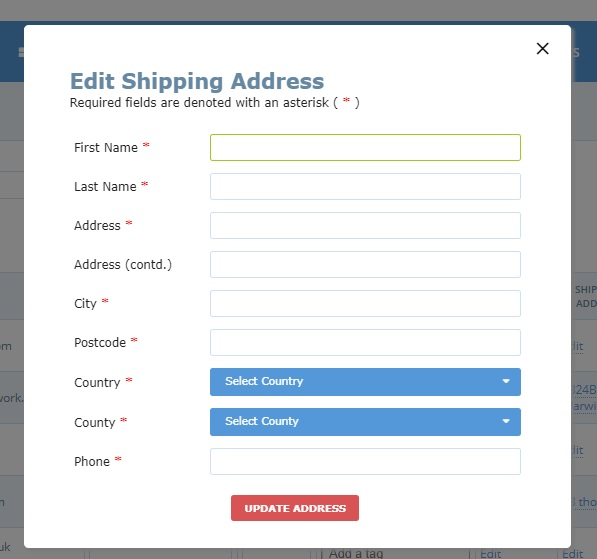
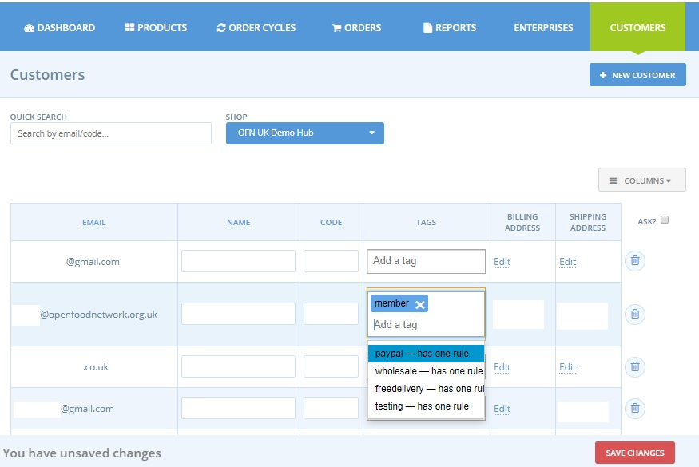

# Customer Management

A list of all customers who have placed an order with your enterprise can be viewed from the Customers menu in the admin dashboard.

You can also manually add a customer by the **+New Customer** button. 


Only people who are in your customer list can be assigned a Tag and hence be assigned to a category.  
_Hence if you have a_ [_private shop_](../private-shopfront.md) _front you will have to manually add all new customers and assign them the correct tag before they can shop._


## Customer Billing and Shipping Address

Each customer can have a default billing and shipping address.  If a customer has a registered OFN account and has completed their details fully their addresses will be copied to this section automatically.  
Storing a default billing and shipping address can make online purchases quicker for the customer.

## Tags \(to group customers in to categories\)

You can assign your customers to groups and then offer [group-specific pricing and/or product listings](tags-and-tag-rules.md).

On the OFN platform this is achieved by assigning all customers belonging to a common group \(ie all your wholesale customers\) the same tag.  
To add a tag, simply type its name in the 'Tags' column on the Customers page. A customer can have several tags and of course the same tag can be linked to several people. 


Careful when you are adding the same tag to multiple customers \(so that they belong to a common group\) to select the identical word \(tags are case sensitive\) from the drop down menu on offer.


Tags also appear in [reports](../../reports.md). You can use them during csv / excel exports to quickly filter data.

