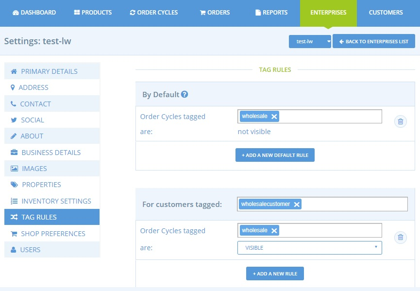
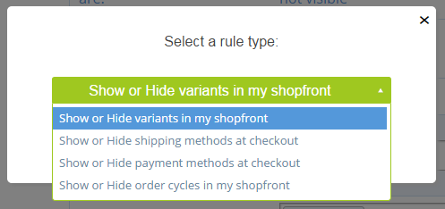

# Tags and Tag Rules

Once customers have been grouped into categories with tags, you will be able to customise their shopping experience in the following ways:

* Making particular variants visible/invisible
* Making certain shipping methods visible/invisible
* Making certain payment methods visible/invisible
* Making order cycles visible/invisible

Most often this feature is required by enterprises who have different shop setups for members/non-members or different groups of customers such as wholesale/retail customers.

## How to set up a Tag rule

To access Tag Rules go to Enterprises -&gt; Settings -&gt; Tag Rules

## By Default

By default, _**all items** will be visible to **all customers**_ whether they are tagged or not.   
You can change the default display rules by selecting **+add new default rule**. Int the example below, by default, all Order Cycles which are tagged 'wholesale' will be invisible.  
\(For this example, only those customers who are tagged with the label 'wholesalecustomer' can view \(and hence purchase from\) Order Cycles tagged 'wholesale'.\)

## Tag Rules

Once you have defined default rules, you can then set up exceptions to these rules for specific customer groups.

* First define the customer group to which the exception will occur.  In the example above, the exception was applied to all customers with the tag 'wholesalecustomer'.
* Then, for this customer group, you can choose to customise their shopping experience in one of four ways:


Remember to add the relevant tags to variants, shipping or payment methods, or order cycles, as well as to customers after you have set up a default or conditional tag rule!


We now look at each option, one-by-one:

### **Show or Hide Variants in my shopfront**

This rule lets you make particular variants visible/invisible to tagged customers. For this rule to operate you need to have tagged the customer and the product variant **in your inventory** \(not in the producer's product list\) with the same tag. 

In the example below the 1 kg variant of delux muesli has been tagged 'member'. It would thus be possible to set up tag rules such that by default only the smaller 500 g \(non-tagged\) variant of delux muesli appears on the shop front unless the customer belongs to a group of buyers all tagged 'member' \(in which case they would be able to view the 1 kg option too\).

### **Show/Hide shipping methods**

This rule lets you make particular shipping methods specifically available or unavailable to certain customers. For this rule to operate you need to have tagged the customer and the shipping method with the same tag. To tag a shipping method, go to **edit** [**shipping method**](../shipping-methods.md) ****and apply the relevant tag. 

In this example, the shipping method 'Collect in Person' has been assigned to customers with the tag 'member'. One could then set up the following:

* a default tag rule: shipping methods tagged 'member' is invisible
* a conditional tag rule: for customers tagged 'member' the shipping method tagged 'member' is visible

Thus, only members would be able to opt to collect their purchases in person.

### **Show/Hide payment methods**

This rule lets you make particular payment methods specifically available or unavailable to particular customers. 


This tag rule might be useful if you only wish to offer members the option to pay by cash on collection \(but make non-members pay upfront by card or PayPal\), or if you would like to offer your wholesale customers only the option to pay by BACS.


For this conditional tag rule to operate you first need to have tagged the customer and the payment method with the same tag. To apply a tag to a [payment method](../payment-methods.md) visit go to Enterprises-&gt; Settings -&gt; Payment methods and select edit.

In this example, the payment method 'Cash' has been assigned to customers with the tag 'member'. One could then set up the following:

* a default tag rule: payment methods tagged 'member' is invisible
* a conditional tag rule: for customers tagged 'member' the payment method tagged 'member' is visible

Thus, only members would be able to opt to pay for their purchases in cash on collection.

### **Show/Hide order cycles at my shopfront**

This rule lets you make certain order cycles visible only to certain customers. 


 This tag rule might be useful if you wish to open two order cycles concurrently with different enterprise fees associated to each. For example, one might be for wholesale customers- displaying bulk buy goods and lower enterprise fees, while another would be visible to the public and list products in smaller quantities but with a higher margin.


For this rule to operate you need to have tagged the customer and the order cycle with the same tag. To tag an order cycle, see the Tags tab in the outgoing section of an order cycle \(page 3 of the [Order Cycle](../order-cycle/order-cycles-for-hubs.md#3-outgoing-products)\).

In this example, the above Order Cycle has been assigned to customers with the tag 'member'. One could then set up the following:

* a default tag rule: order cycles tagged 'member' are invisible
* a conditional tag rule: for customers tagged 'member' an order cycle tagged 'member' is visible

Thus, only members would be able to purchase goods from this order cycle.

## Customer Specific Pricing

Sometimes our users want to charge different prices for different customers, often based on their member vs non-member \(or wholesale vs retail\) status. Currently, there’s no way to automatically charge different prices for members vs non-members, but there are some round about ways of achieving the same thing.

You can use **customer tagging**, with tag rules to achieve this by:

* Make certain [variants](tags-and-tag-rules.md#show-or-hide-variants-in-my-shopfront) available only to specific customer groups: for example 'bulk buys' at a reduced rate per weight available only to customers with a wholesale tag.
* Run more than one [Order Cycle](tags-and-tag-rules.md#show-hide-order-cycles-at-my-shopfront) concurrently with only members \(or wholesale customers\) able to view and purchase from the order cycle carrying a lower enterprise fee.
* You could use [shipping method fees](tags-and-tag-rules.md#show-hide-shipping-methods) to charge different prices to different customers. To ensure that only members select the reduced 'member rate' you would need to add a tag to this shipping method \(else anyone could 'cheat' and select the lower cost shipping rate\).
* If you make a [payment method](../payment-methods.md) is cash on collection available to members only then you would add a mark up to all other payment methods, such that non-members are charged more for their goods.


Beyond the use of tags, some enterprises opt to set up two hubs: one for wholesale customers/members only \(see Private Shop front\) and one for everyone else.

By using the [Inventory](../../products-1/inventory-tool.md) feature the two shops could offer the same products but you can set the pricing for each independently. 

This method offers the most flexibility: prices can be fine-tuned for customer groups on a case-by-case basis rather than a blanket percentage or fixed price difference.


