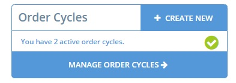
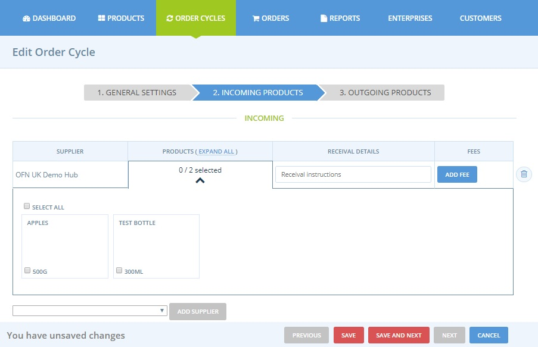
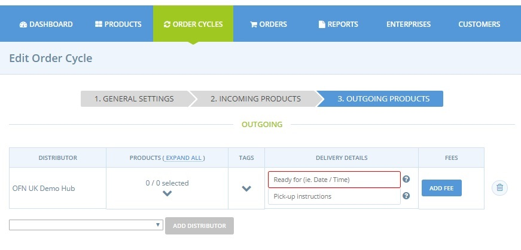
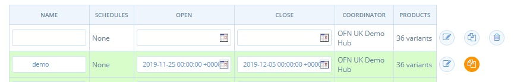

# Order Cycles \(for Hubs\)


Read on if you selected the Enterprise Profile '[Producer or Non Producer Hub](../../../your-quick-start-on-ofn-given-who-you-are.md#hub)'. 

Visit this [page](order-cycles-for-producers.md), if you registered as a '[Producer Shop](../../../your-quick-start-on-ofn-given-who-you-are.md#shop)' and want to set up an order cycle for your shop front.


You open you shop by creating an Order Cycle. When you make an order cycle you select when you shop is open \(from and until\), which products will go into the shop, and any fees that you'll apply.

**Why Order Cycles?**    
Some hubs may wish to have an online store which is perpetually open, and to fulfill orders on a one by one basis, as they are received. However, many hubs operate on a periodic ordering system, which allows them to process orders in bulk, making their production, packing and distribution activities more efficient \(and reducing associated overhead costs\). 

For example, an order cycle might be open for two weeks. At the end of the fortnight, all orders will be packed and delivered at the same time on the following Wednesday. Once this batch of orders has been delivered, a new order cycle may reopen.

## Viewing Order Cycles

You can create an order cycle, and view previous order cycles by clicking on **Manage Order Cycles** on your [dashboard](../../dashboard.md).

Or from the horizontal menu at the top of the page.


You will not be able to publish a live order cycle until you have at least one [payment](../payment-methods.md) and [shipping](../shipping-methods.md) method set up for your enterprise.


## Create a New Order Cycle

The first step is to select a coordinator for your order cycle. Only the enterprise who coordinates an order cycle have permission to modify and manage **all** aspects of the sales cycle.   
Other enterprises involved in an order cycle \(as suppliers or distributors only\) will have restricted access.   
For more information on cross-enterprise management in the context of order cycles, [click here](permissions-in-multi-enterprise-order-cycles.md).

Once the order cycle coordinator has been chosen, the process of setting up is divided into three steps:

### 1\) General Settings

**Name \(**_**required**_**\):** Give the order cycle a name which is meaningful to you. We recommend that you follow a consistent naming protocol e.g FoodHub\_Week27\_2014. We also recommend that you include the name of your hub in the order cycle name, so that OFN support can identify your order cycles if you need assistance.

**Orders Open at:** This is the date and time at when your OFN store will be open, visible and start to accept orders from customers.

**Orders Close:** This is the date \(and time\) when your OFN store will close and stop accepting orders. If you intend to have an order cycle which is continuously open, select a close date which is well into the future.

**Schedules:** Leave blank unless using [Subscriptions](../../subscriptions/).

**Add Coordinator Fee:** As a hub, the coordinator is most likely you. Here you can apply your Enterprise Fee which acts as the markup. The fee will be calculated according to the calculator selected in [Enterprise Fees](../enterprise-fees.md). You can only apply an enterprise fee which has previously been created.

### 2\) Incoming Products

On this page you can select the producers, and their produce, which will be available in this order cycle. In the dropdown menu you will see all producers who have granted you permission to add their produce to your order cycle \(See [Enterprise Permissions](../../enterprise-profile/enterprise-to-enterprise-permissions-e2es.md) section\).   
After selecting a supplier and clicking **Add Supplier** all of the products associated with that supplier will be visible. Check those products you wish to add to the store, or click **select all.** 


Products which are out of stock \(ie their 'in stock' value is zero\) are included in this list.  If added to an order cycle they will not appear on our shop front.  It is always good to double check stock levels. 


The **Receival Details** field is optional.  Information added to this field will automatically added to any email sent to producers at the end of an order cycle \(after clicking 'Notify Producers'\).  It might be a good idea to include an exact delivery address for produce prior to distribution to customers here.

The **Add Fee** button in this section, at the end of each producer's entry in the table, allows you to add different [enterprise fees](../enterprise-fees.md) to different suppliers. For example, transporting flour or heavy goods to customers may be more expensive for a hub than salad.  Hence, a hub can, in a transparent manner, add a slightly higher enterprise fee to all goods supplied by the flour miller than the salad farmer.

Select the name of the enterprise in the first dropdown box, then click the name of the enterprise fee in the second dropdown box. In the example below, an enterprise fee named OrderAdmin is applied to the Producer of Fruit.


This fee will be applied to all of the Producer of Fruit’s products which are purchased. The fee is calculated according to the fee calculator which was selected when the [Enterprise Fee](../enterprise-fees.md) was created.


### 3\) Outgoing Products

Here you can select one or more hub-distributors.  All hubs chosen to be a distributor in this order cycle will have an open shop front for the duration of the order cycle.  
In a **simple model**, only one hub is listed as the sole distributor for the order cycle. Select the hub, and check the box 'Select all' to add all incoming products to the shop front.   
For more flexibility, the same order cycle may have **multiple hub distributors**.  In this case you may wish to select a different subset of the available incoming products for each distributor, and/or, add different delivery dates for each.

The **tags** column is where you can tag your order cycles to customise whether they are visible/invisible to certain customers. See [tags and tag rules](../customer-management-and-conditional-displays-prices/tags-and-tag-rules.md) for more information.

The **‘ready for \(ie Date/Time\)’ \(**_**required**_**\):** This box tells the customer when their order will be ready for either collection or delivery. If your order cycle is a perpetual one, which fulfills orders on an individual basis rather then in bulk, you should enter something like ‘Two days after order is received’. The example below shows how an order cycle with a ready for date of  'Saturday 7th December’ is displayed on the shop front.

The note is also shown at check out, when the customer selects their shipping method \(see below\) and is included in the order confirmation email.

The **Pick-Up Instructions** message will be included in the customer’s order confirmation email, below the message that corresponds to their chosen shipping method \(see below\). This note is designed to only be visible to customers, so you can include more sensitive information like addresses, or phone numbers etc. See below for an example of the order confirmation email.

**Add Fee:** Again, a previously created enterprise fee can be assigned to this distributor.  For simple models \(with one hub distributor, who also is the coordinator of the order cycle\) adding a fee at this stage is the same as adding a 'Coordinator Fee' \(it will apply to all products\).  
For complex models, the coordinator may wish to add different fees to all products sold though each distributor.  The best place to implement this functionality is here.

### Open the shopfront

Click **Save** to schedule the order cycle. If the opening date has already passed, your shop is instantly open! If you are not ready to open right away, enter dates in the future, which you can change later. 

For periodic, repetitive order cycles, you can copy an existing order cycle and change the dates, to make the process quicker. See below.

Order cycles will display as green when they are active, yellow when scheduled for a future date, and grey when they have closed. When an order cycle close over one month ago, it will no longer display on this list. To view all of your past order cycles click ‘show more’ at the top of the list.

## **‘Notify Producers’ Button**

By using this button at the top of the page, all the producers linked to the order cycle will receive an email containing a list of the products ordered for that particular order cycle thus far.  Delivery instructions \(if this field is completed in the incoming products section\) will be also sent in the email.

