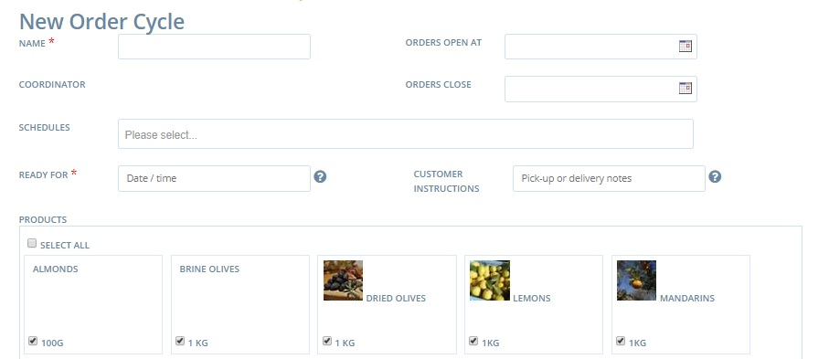

# Order Cycles \(for Shops\)


Read on if you're registered as a [Producer Shop](../../../your-quick-start-on-Harvest To Order-given-who-you-are.md#shop) and wish to open your own store.

Visit this [page](order-cycles-for-hubs.md) if you wish to open an online store for a multi-producer shop front \([hub](../../../your-quick-start-on-Harvest To Order-given-who-you-are.md#hub)\).


In Harvest To Order, Order Cycles are where shop managers open their shop. This involves selecting which of their products are in stock, what fees are applied and what dates the shop will open and close.

**Why use Order Cycles?**  
Many producers, who are selling small quantities of products, may find it useful to have an order cycle that is perpetually open, and to fulfill orders individually, as they are placed.   
Other producers, who sell large quantities of products, to multiple customers, find it useful to establish periodic order cycles, which are collectively fulfilled at the end of a period. For instance, a farmer may have an order cycle which is open \(accepting orders\) for two weeks. At the end of this order cycle, all of the orders are packed, sorted and distributed at the same time. Once this batch of orders has been fulfilled, a new order cycle is opened. Structuring order cycles in this way can make the tasks of packing and delivering orders more efficient.

## Access Order Cycles

When logged into your admin dashboard you can access order cycles from this button:

Or 'Order Cycles' on the blue horizontal menu across the top of the page.  Then click on **+New Order Cycle**


Note you cannot create an order cycle until you have set up ****at least one [shipping ](../shipping-methods.md)and one [payment method](../payment-methods.md).


You will now be redirected to a new screen:

  
**Name \(**_**required**_**\):** Choose a name for this order cycle. This will only be visible to you, so it can be named anything which is meaningful for you. We recommend that you follow a consistent naming protocol e.g FoodHub\_Week27\_2014.

**Orders Open:** This is the date at which your Harvest To Order store will be open, and start to accept orders.

**Orders Close:** This is the date when your Harvest To Order store will close, and stop accepting orders. If you intend to have an order cycle which is continuously open, select a close date which is well into the future.

**Schedules:** leave blank unless implementing [Subscriptions](../../subscriptions/).

**Ready for \(ie Date/Time\) \(**_**required**_**\):** This box tells the customer when their order will be ready for either collection or delivery. 


If your order cycle is constantly open, rather than periodic, then use this box to enter something like 'Two days after ordering'



If you have product or location specific order cycles running concurrently you may like to 'hack' this text field by adding extra information eg. 'Meat for Tues'


**Customer Instructions:** This message will be included in the customer’s order confirmation email, below the message that corresponds to their chosen shipping method \(see below\). This note is designed to only be visible to customers, so you can include more sensitive information like addresses, or phone numbers etc. 

**Products:** You must select the products which will be visible in your online store during this order cycle. 


Remember, if you add new products after an order cycle is underway, you will need to select them here else they won't appear online!


**Add Coordinator Fee:** There is the option of adding a coordinator fee. Here you can apply an [enterprise fee](../enterprise-fees.md) that has been created for your enterprise. 

## Open the shopfront

Click Create to save this order cycle.


If the opening date of your order cycle has already lapsed then your shop front will be live immediately!  
If you are not quite ready to open the shop, set the 'Opens At' date to a time in the future.


For periodic, repetitive order cycles, you can copy an existing order cycle and change the dates, to make the process quicker. Select the icon with two sheets of paper to the right of the table as highlighted below:

Order cycles will display as green when they are active, yellow when scheduled for a future date, and grey when they have closed. If an order cycle closed over one month ago, it will no longer display on this list. To view all of your past order cycles click **show 30 more days** or **show 90 more days** at the bottom of the list.

