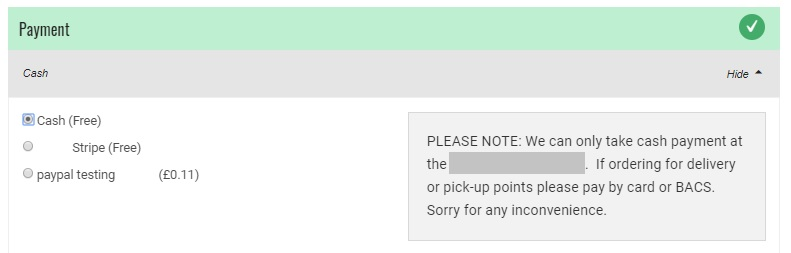
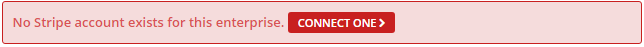
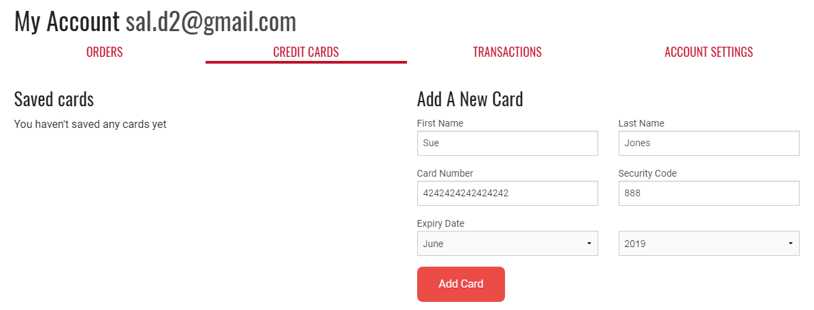
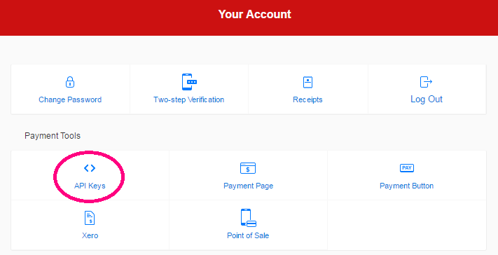
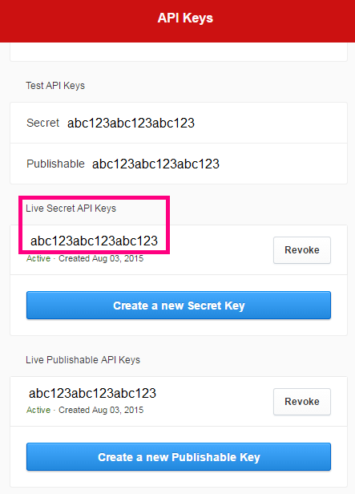
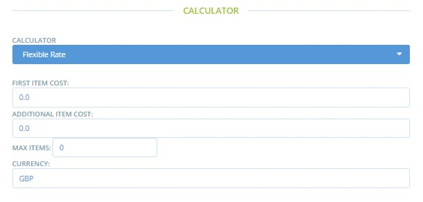

# Payment Methods


You **must** create at least one payment method before you can open your shop.


## Setting up a Payment Method

* Go to the Payment Methods page by clicking on **Enterprises** in the blue horizontal menu, and then click **Settings** next to your enterprise. The **Payment Methods** page is found in the menu on the left hand side.
* Click **Create new payment method +** . You will be directed to a page like this:

* Tick your enterprise, in the box on the right hand side of the page titled Hubs. This indicates which enterprise the payment method you are about to create will apply to. You can select more than one enterprise.
* **Name:** Choose a name for this payment method. \(eg 'Pay with credit card using Paypal'\). This name is displayed at checkout and on customers' order confirmation emails.

* **Description:** provide further details about the payment method. For example, for a bank transfer, you would enter the bank account details in this box into which you would like a customer to make the BACS payment. This description is displayed at checkout and in order confirmation emails.
* **Active:** Select whether this payment method is currently visible and available, or not.
* **Tags:** Use tag rules if you want to make certain payment methods available/unavailable for specific customers \(for example you may wish to allow only wholesale customers to pay by BACS but 'force' domestic customers to pay by Credit Card or PayPal.\). For more information read [here](customer-management-and-conditional-displays-prices/).
* **Payment providers**: Select the option which is relevant to the payment method you are creating. There are five options:
  * Cash / EFT / etc. \(Cash, cheque or bank transfer. These payments do not go through an online payment portal and do not involve automatic validation\) 
  * MasterCard Internet Gateway Service \(MIGS\) 
  * PayPal Express 
  * [Pin Payments](https://pinpayments.com/) \(Australia only\) 
  * Stripe
* **Calculator:** Select how you would like any charges associated with the payment method to apply to an order. Note that payment method fees can be set to zero. See below for more information about [Payment Method Fees](payment-methods.md#fees-on-payment-methods). 

By clicking Create, the payment method will be created and you will have new fields to define payment method fees. These fields visible depend on which 'Calculator' you selected. 


If you change the Payment Method fee 'Calculator' field you must first save your changes \(Update\) for the new associated fields to become visible.


## Integrated Payment Providers

For Paypal, MasterCard, Stripe and Pin Payments \(Australia only\) additional instructions are below.



To setup a PayPal payment method, you need a PayPal business or merchant account. You can create one [here](https://www.paypal.com/au/webapps/mpp/merchant). Once you have that, you can set up ‘API access’ within PayPal, which will enable OFN to connect customers directly with your PayPal account.

1. Login to your PayPal Account
2. Click Tools and then select API credentials

1. Click on ‘View API Signature’  and you will see the API details you’ll need to set up Paypal in OFN.

1. In OFN, make sure you are logged in as your Enterprise User. Go to an Enterprise and create a Payment Method. Select PayPal and fill in the details from the PayPal site.

**Login:**Type the API Username.

**Password:**Type the API Password.

**Signature:**Type the Signature in this field.

**Server:** Change the ‘server’ field to ‘live’ – this is case sensitive.

**Solution:** Solution determines whether or not a user needs a PayPal account to check out.

Type “Mark” if you do want users to have a paypal account, or “Sole” if they can checkout without a Paypal account \(with credit card\).

**Landing Page:** You can select which page to show customers once they’re redirected to PayPal.

Type “Login” to direct customer to the login form for PayPal \(if you selected “Mark” above\). Or type “Billing” to show show customers a form where they can enter their credit card data and possibly sign up for a PayPal account \(if you selected “Sole” above\).



 MasterCard Internet Gateway Service \(MIGS\)

Set up of this service needs to be done through your bank. So far it has been tested with Bendigo Bank.



[Stripe](https://stripe.com/au) is an online payment platform similar to Paypal. It will allow you to accept credit card payments from your customers. Stripe is a global platform, but is only available on certain OFN instances. Contact your [local OFN team](https://openfoodnetwork.org/ofn-local/) to see whether it’s available on your OFN.

#### Why use Stripe?

Stripe is simple to setup for shop owners and is reasonably priced. The fees charged by Stripe vary in each country; [Australia](https://stripe.com/au/pricing), [Canada](https://stripe.com/ca/pricing), [France](https://stripe.com/fr/pricing), [UK](https://stripe.com/gb/pricing), [USA](https://stripe.com/us/pricing).

Stripe is also easy for customers to use. Unlike Paypal, when the customer checks out, they don’t need to login with Paypal to place their order, rather they just need to enter their card details and then complete their order.

Stripe is the recommended payment method for shops who wish to use [**subscriptions** ](../subscriptions/)on OFN, as Stripe allows customers to give permission to a shop to automatically bill their credit card for subscription orders. This isn’t offered by Paypal, Pin or MIGS payment platforms.

#### Setup

**Connect with Stripe**

Before you can setup a payment method that uses Stripe, you’ll need to Connect with Stripe. To do this, click on the ‘Connect with Stripe’ button.

You’ll be taken to a form to fill in your details. If you already have an account with Stripe, you can login, if not, fill in the form to create a Stripe account.

The information you’ll be asked for includes: country, a description of your business, your Business address and ABN, your personal details and your bank account \(where received payments will be deposited\).

**Create a New Payment Method**

Once you’ve connected with Stripe, you can then create a payment method which will work with your connected account.

Treat the **Name**, **Description**, **Active** and **Tags** fields as you would with any payment method.

**Provider:** Select Stripe.

Once you select Stripe, ‘Provider Settings’ will be shown.

**Stripe Account Owner:**

Select the enterprise that has a Stripe account connected.

If you select an enterprise that is not Connected to Stripe \(see above\) , you will get the error shown below. Either click ‘Connect One’ or return to your Payment Methods tab to Connect with Stripe. See instructions above.

#### Stripe Payments for Customers

When customers checkout in a shop and pay with a Stripe payment method, they’ll have the options of selecting a tickbox allowing their credit card details to be stored against their account \(if they are logged in\).

Customer can also save a credit card in their Account, or delete saved ones.

When the customer next shops with an OFN shop offering Stripe as a payment method, they’ll be able to select from their saved credit cards.

**Viewing and redeeming your payments via Stripe**

When a customer pays for their order with Stripe, the funds \(minus Stripe's fees\) will go to your stripe account. Depending on your setting in Stripe the funds will be automatically transferred to your chosen bank account periodically.

**Taking further payment**

If you need to take additional payment from a customer because they have further balance due,  you can create an invoice in Stripe. The customer will get sent an email asking for them to pay with Credit/Debit card. This won't be communicated to OFN, so you'll need to mark the payment off manually.




For Pin Payments you only require your API key. You need to set up an account with Pin Payments first, and can get a discount by signing up as an OFN member \([https://pin.net.au/partners/open-food-network/signup](https://pin.net.au/partners/open-food-network/signup)\)

**API Key:**Enter your “Live Secret API Key’ here – you can find this in your PinPayments account \(see below\). First from your account, select API Keys. Then once you have generated an API key, copy the ‘Live Secret API Key’ and paste it into the API key field in OFN.

**Server:**Type ‘live’ – this is case sensitive.



## Payment Method Fees

You can attach a fee to payment methods. Most commonly this is used to pass on a payment portal's fees to the customer.  For example, you may wish to charge the customer for the convenience of paying by PayPal to cover the fee charged by PayPal.


Payment Method Fees DO NOT include tax \(VAT\)


### Fee Calculators

**Flat Percent:**  This fee is charged as a percentage of the total amount charged in the order.

**Flat Rate \(per order\):** This fee is applied as standard fee to all orders, regardless of the size of the order.

**Flexible Rate** – This fee calculator is especially useful if you'd like to encourage customers to place large orders: the cost of payment can be reduced or zero when the threshold number of items has been reached. 

* ‘First Item Cost’: The fee charged for the first item in the order.
* ‘Additional Item Cost’: The fee charged for items beyond the first item.
* ‘Max Items’: The maximum number of items on which the fee will be applied. Items purchased beyond this amount will be not be charged the fee.

> For Example: if the 'First Item Cost' is set to £0.20, 'Additional Item Cost' is £0.10 and 'Max Items' is 3 then a customer who purchases 5 items will be charged £0.40 in payment fees \(£0.20 for the first item, £0.10 for items two and three, and £0.00 for items four and five\).

**Flat Rate \(per item\):** This fee is a constant fee, applied to products listed as ‘items’. \(It is not applied to products sold by weight or volume. Hence there will be no associated payment method fee charged to a customer who, for example, buys rice by kg.\)

**Price Sack:** This is a flexible payment fee method charged by _total monetary sale_, rather than number of items purchased \(Flexible Rate above\)

* ‘Minimum Amount’: Monetary value of the threshold between Normal Payment Method fee and Discounted Payment Method fee. 
* 'Normal Amount': Payment Method fee applied to sales below the threshold stated in 'Minimum Amount'.
* ‘Discount Amount’: Payment Method fee applied to sales above the threshold stated in 'Minimum Amount'.


Payment portals often charge businesses a fixed amount per transaction plus a small % of the total cost.  Thus fees encountered by a Hub or Shop for customers who purchase the same total amount in multiple small sales will be higher than if the customer did all their shopping at once. 

The Flexible Rate and Price Sack calculators, applied to payment method fees, may prove useful to counter balance this.


## Refunds

Issuing and managing refunds depends on how a customer originally paid for  their order.  More details are found [here](../orders/refund-payments.md).

