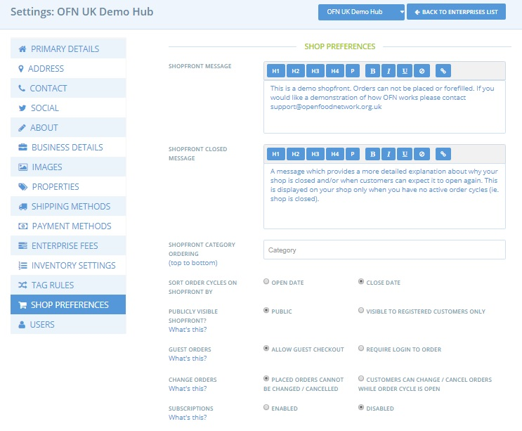
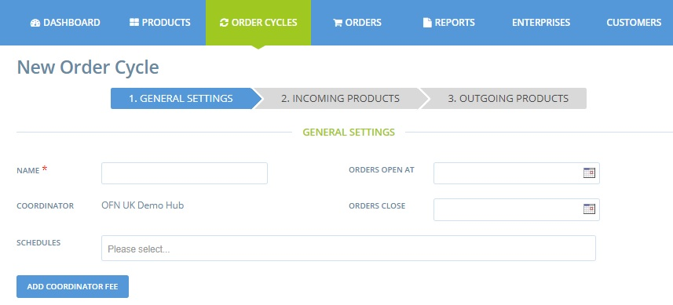

# Configuration

## Activate subscriptions

To activate the subscription functionality for your enterprise, go to Enterprises-&gt; Settings-&gt; [shop preferences](../enterprise-profile/enterprise-settings.md#shop-preferences).

At the bottom of the page change Subscriptions to 'enabled'

**Guest orders**: For enterprises with subscriptions enabled, we recommend that you require all customers to login before they can shop with you. This will ensure that any customer with a subscription will login and see their existing subscription order, and not accidentally place a duplicate order.

**Change orders**: For customers with a regular repeating order from your enterprise on subscription, then the following options imply:

* _Placed Orders cannot be changed/cancelled:_ The customer will need to contact you to modify their regular order \(alter quantities of each product requested or cancel the order\). 
* _Customers can change/cancel orders white order cycle is open:_ The customer can modify the quantities of products they request in their subscription and/or cancel the entire order.


In all cases, if a customer with a subscription order wishes to purchase a product which is not part of their regular order they will have to make a second basket and checkout. _Neither you nor they can not add new products to their subscription order once the order cycle is open._


## Shipping and Payment methods for Subscriptions

When you are creating the customer's subscription, you'll need to select which shipping method they'll use and which payment method they'll be billed with.  This will then subsequently apply to all following orders placed on their behalf by the subscriptions

### **Shipping methods**

You can apply any [shipping/delivery method](../shopfront/shipping-methods.md) to a subscription. 

### **Payment methods**

You can only assign two types of [payment methods](../shopfront/payment-methods.md) to subscriptions.

1. **Manual payment methods:** Cash, cheque, bank transfer \(ie. any method which does not involve automatic validation online by the OFN platform\).
2. **Stripe:** Stripe is a payment gateway that takes payment with credit cards.  Details on how to configure Stripe payments for your enterprise can be found [here](../shopfront/payment-methods.md#integrated-payment-providers). 


With each order automatically placed by a subscription, the customer's bank card will be debited for the order \(on closure of the associated order cycle\). The amount debited will reflect any modifications made by you or them to the order.  
Customers will not be charged if they cancel their subscription order.



For the customer to be debited correctly, it is necessary for them to have an account on the Open Food Network platform.  To their OFN account they must have registered a default credit card and given their authorisation for your enterprise to debit from that card.  More information can be found [here](subscriptions-the-customers-perspective.md).  



If you use Stripe as the payment method for subscriptions it is helpful to the customer if you add a clear, detailed explanation of how the payment will be processed, should they choose this option.  
  
For example, rather than calling the [payment method](../shopfront/payment-methods.md#integrated-payment-providers) 'Credit card' you might like to call it 'automated credit card billing for subscriptions'. A possible description could be 'Your default credit card saved in your OFN account will be charged when your subscription order is confirmed on Wednesday nights'. This name and description will show on the email confirmation to subscription customers \(see example below\), so it's good to make it details so the customer knows what to expect.


## Gather information from your customers

To setup a subscription for a customer you'll need to get some information from them, as detailed below:

**Name**, **phone number** and **email address:** Remember that any customer wishing to have an automated regular order \(subscription\) with your enterprise MUST have a registered and confirmed user account on the OFN platform.  Customers with subscriptions must be on your enterprise [Customer List](../shopfront/customer-management-and-conditional-displays-prices/customers.md). See [below](subscriptions-configuration.md#4-add-your-subscribers-to-your-customer-list) for more details.

**Billing and shipping address**

**Products:** Which items do they want to include in their subscription?

**Shipping/Delivery method**: You need to assign a shipping/delivery/collection method to their subscription order.  How would they prefer to receive the goods?

**Payment method**: Customers can select from your manual payment methods \(e.g. cash, bank transfer\), or paying with their credit card through your shop's Stripe account. If the customer wishes to pay for their subscription orders by Stripe then they will need to add a default payment card and give authorisation. See [here](subscriptions-the-customers-perspective.md#saving-credit-cards-and-authourising-charges) for more details.

**Start and End Dates for their subscription orders:** Remember, for a subscription order to be created for a given order cycle it must have a start date either before or after the order cycle opening date, and the subscription end date must be after the order cycle close date.

## Add your subscribers to your customer list

Before you can setup a subscription order for a customer they need to be added to your [Customers list](../shopfront/customer-management-and-conditional-displays-prices/customers.md). 

**After you've added your customers to your customer list email them** and [ask them to sign up for an account on OFN](subscriptions-the-customers-perspective.md#signing-up-to-ofn).  If you plan to bill customers using Stripe, you need to also request that they follow the additional steps outlined [here](subscriptions-the-customers-perspective.md#saving-credit-cards-and-authorising-charges) for adding a default credit/debit card to their OFN user account and giving your enterprise authorisation to take payments.


You can add customers to your Customer list before or after they've signed up for an account with OFN. However, before a subscription order can be successfully setup the customer must have confirmed the email address to which their OFN account is registered.



If you wish to debit a customer for their subscription order by Stripe then they must be added to your [Customer list](../shopfront/customer-management-and-conditional-displays-prices/customers.md) BEFORE they can [authorise your enterprise to take payments ](subscriptions-the-customers-perspective.md#saving-credit-cards-and-authorising-charges)from their credit/debit card.  
Hence we recommend the following procedure:

1. Contact the customer and obtain all the info you require \(see [above](subscriptions-configuration.md#gather-information-from-your-customers)\)
2. Add them to your [customer list](../shopfront/customer-management-and-conditional-displays-prices/customers.md).
3. Email the customer, asking them to [register with OFN](subscriptions-the-customers-perspective.md#signing-up-to-ofn) for an account and [add their credit/debit card details](subscriptions-the-customers-perspective.md#saving-credit-cards-and-authorising-charges) to that account.
4. [Create the subscription](subscriptions-creating-and-managing-orders.md).


## Schedules


If you are new to OFN we encourage you to get familiar with setting up [order cycles](../shopfront/order-cycle/) before setting up schedules and subscriptions


### About Schedules

Subscriptions are setup so that every time an enterprise opens an order cycle, orders can be automatically generated for customers who have a subscription with that shop.  The frequency with which a subscription order is placed for a particular customer \(ie which of your active order cycles triggers their subscription\) is controlled by a facility called '**Schedules**'.  

Schedules are groups that order cycle can be assigned to. Once a schedule has been created, customer subscriptions are applied to the schedule, so that an order for their subscription will only be generated for new order cycles in that schedule.  


You may have some customers who would like a regular order every week, in which case you would add their subscriptions to a schedule which includes all of your weekly order cycles. For other groups of customers, desiring their orders only fortnightly/monthly you can create additional schedules which only include alternate/one-in-four of your weekly order cycles.



There's lots of flexibility in this arrangement and so feel free to experiment to come up with the order cycle-schedule combination which works best for your enterprise.  For example you may wish to have 'odd week' and 'even week' schedules, 'wholesale' schedules, 'monthly meat' schedules....


### Create a schedule

Having completed all the steps outlined above, the **+New Schedule** button will appear at the top of your Order Cycles menu:


You must have at least one open or due to open order cycle to be able to create a new schedule.


**Name:** Give the schedule a logical name which describes this group of order cycles. E.g. ‘weekly’, ‘monthly’, ‘Tuesday Deliveries’, ‘wholesale’ or ‘retail’. This name is not visible to customers.


If you manage several OFN enterprises, with subscriptions being enabled in more than one, then naming your schedules clearly is essential eg. weekly\_hubA, weekly\_hubB, fortnightly\_hubA, fortnightly\_hubB.  
Each enterprise will need a different schedule but when you create a subscription for a customer the schedules for all your enterprises will be visible. Hence, the descriptive name will help you make sure the subscription is created for the correct enterprise for that particular customer.


You can add existing order cycles into and out of the new schedule by clicking the &lt; and &gt; buttons.

Click **create** when you are finished.

### Edit or Delete a schedule

To edit or delete a schedule, click on the schedule’s name next to a corresponding order cycle, in the ‘schedules’ column.  \(The 'Schedules' column may need to be made visible by ticking it in the drop-down columns menu at the top right.\)

You can change the name of the schedule, add/remove order cycles from it or delete the schedule.


You can not delete a schedule if there are subscriptions associated with it.


### Adding or removing order cycles from schedules

You can add and remove order cycles from schedules by either editing the schedule \([above](subscriptions-configuration.md#edit-or-delete-a-schedule)\), or by editing the order cycle and adding/removing the schedule in the ‘schedules’ field:


Order cycles can be in more than one schedule.  For example if your order cycles are weekly but you have three schedules \(weekly, fortnightly-odd weeks and fortnightly-even weeks\) then one order cycle might be associated with both the 'weekly' and 'fortnightly-odd' week schedules.


