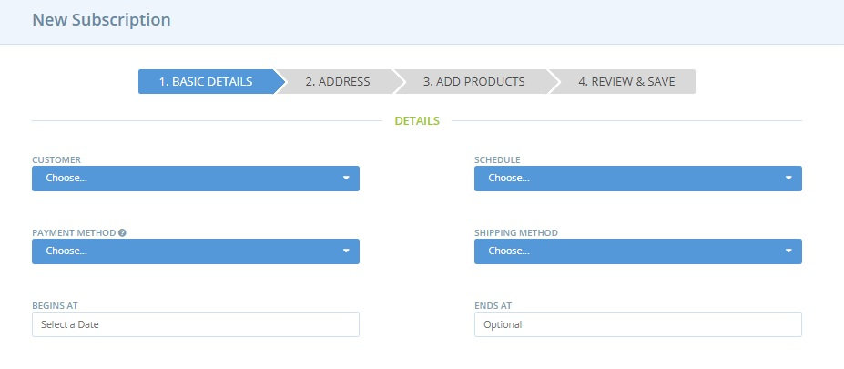
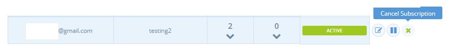

# Subscriptions- Creating & Managing orders

This page describes how shops can setup unique subscriptions for individual customers, including which items are included in their subscription, which [schedule](subscriptions-configuration.md#schedules) the subscription applies to \(ie the rate at which they receive their order\) and how to pause/edit their subscription.


 In this first version of the subscriptions feature, **enterprises must setup subscriptions on behalf of their customers.** Customers can not setup their own subscriptions.


**Checklist of things to do before you create subscriptions for you customers:**

* Enable subscriptions in your [Enterprise Settings](subscriptions-configuration.md#activate-subscriptions)
* Setup [shipping and payment methods](subscriptions-configuration.md#shipping-and-payment-methods-for-subscriptions)
* Have made contact with you customers to [get their details](subscriptions-configuration.md#gather-information-from-your-customers)
* Added your subscription customers to your [customer list](subscriptions-configuration.md#add-your-subscribers-to-your-customer-list).  
* Have contacted your customers to request that they [sign up for an account with OFN](subscriptions-the-customers-perspective.md#signing-up-to-ofn), and _if_ they will be billed with Stripe, to request they [save their card and authorise your shop to charge it](subscriptions-the-customers-perspective.md#saving-credit-cards-and-authorising-charges).
* Created at least one [Schedule](subscriptions-configuration.md#schedules)

## Create subscriptions

Click on **Orders** in the blue horizontal menu and then select **Subscriptions** in the green sub-menu.

Click **+ New Subscription** to setup a recurring order for your customer.  You will first be prompted to select the shop with which you wish to create the new subscription.  


You must have created a schedule of order cycles before you can create a subscription. Read more [here](subscriptions-configuration.md#schedules).


### Basic Details

**Customer:** Select a customer from the drop-down list. You can only choose from those people added to the [Customer List](subscriptions-configuration.md#add-your-subscribers-to-your-customer-list) for the Enterprise with which you are creating the subscription. 

**Schedule:** Select the schedule that this customer wants to subscribe to.

**Payment method:** Select the customer’s preferred payment method. This must be either Stripe or a manual payment method \(cash, cheque, bank transfer\). See [here](subscriptions-configuration.md#payment-methods) for more information. 

**Shipping method:** Select the customer’s preferred shipping method.

**Begins at:** This is the date that the customer’s first subscription generated order will be generated. 


If this date is midway through an open order cycle in their schedule there will be an order generated for that order cycle. If not, their first subscription order will be placed when the next order cycle to open in their schedule begins.


**Ends at:** After this date the customer’s subscription orders will no longer be generated. This field is optional, if left blank the order will continue to be generate indefinitely. 


If the 'Ends at' date falls in the middle of a future order cycle then no subscription order will be placed.For example:

* If Ends at date is 10/01/2020 but closest order cycle in this customer's schedule is due to open 9/01/2020 and close 11/01/2020 then no order will be generated for the customer.
* If Ends at date is 12/01/2020 then the above order cycle will generate a last subscription order for the customer.


### Address

Fill out the customer’s billing and shipping details. Address details for customers who have placed orders on OFN previously will load automatically.


If you update the customer's address/contact details in the [Customer](../shopfront/customer-management-and-conditional-displays-prices/customers.md) page, the change won't automatically carry through to their subscription.  You will need to update their details here too.


### **Add Products**

Add the items the customer wishes to receive from your enterprise on a regular basis.


You can only add products which are listed in future order cycles for your enterprise which also belong to the customer's chosen subscription schedule.


### Review & Save

Check that details are correct and then click **Create Subscription** or **Cancel**.


If the schedule for which you have just created a customer's new subscription has an open order cycle then their first order will be generated immediately unless you change the 'Begins at' date to some point in the future.


#### **What happens if the price of a product changes after the subscription is made?**

The prices of items within subscriptions will update and the customer will be charged according to the updated price.  At the start of each order cycle with which their subscription is generated they will receive an email with a summary of their order, including up-to-date prices.

#### **What if a product in a subscription is not available in an order cycle?**

When an item in a subscription is not available \(for example if it is a seasonal product\) the customer will be alerted in their confirmation emails.

## Edit a customer’s subscription

### Edit the base subscription

To make changes to the whole subscription \(ie all orders placed from now on for the customer\) then visit **Orders** \(blue menu\) -&gt; **Subscriptions \(**green sub-menu\). 

Select the enterprise with which the customer has a subscription from the drop-down menu.  

A table listing all your customers' subscriptions will be then visible.   Select the Edit \(pen and paper\) icon to the right of the customer: 


You can change the products the customer orders via subscription, their preferred shipping and payment methods and the start/end dates of their subscription.



You can not change the schedule of the customer's subscription. Instead the subscription must be recreated in the new preferred schedule and the old version deleted.


### Edit one specific order

If you want to change a single upcoming order in a subscription you can click on the number in the customers’ _**orders**_ column.

This will reveal all upcoming orders in the schedule, and you can then edit a specific order.

### Delete a subscription

To delete a subscription for a customer who no longer wishes to receive the goods from you on a regular basis, click the **cross** button to the right of the table. This will prevent any future subscriptions from being generated and delete this subscription permanently.


 If you delete a subscription while there is an open order cycle you'll be asked whether you want to keep the customer's open order, or if they want to delete the current order.


### Pause a subscription

A customer may want to pause their order while on holiday for instance. In this case, click on the **pause** button \(two vertical lines\) to the right hand side of the subscriptions table. This will prevent all future orders in the subscription from being generated, until it is activated again. 

To un-pause \(re-activate\) a subscription, click on the **play** \(arrow\) button.


If you pause a subscription while an order cycle is still open, you'll be asked whether you'd like to keep the current order or not. 

Subscriptions re-activated in the middle of an open order cycle will generate orders immediately.


## How are subscriptions processed?

You have set up a subscription for a customer. What happens now, each time an order cycle opens and closes?

### **Order Cycle belonging to the subscription schedule opens:**

* Your customer's order will be created immediately.  They will receive an email notifying them of this.
* Stock levels of products ordered by the subscription will be deducted accordingly at this time.
* An email will be sent to the [manager of the enterprise](../enterprise-profile/enterprise-settings.md#users) coordinating the order cycle concerned summarising how many subscription have been placed, and how many had issues \(e.g. insufficient stock\). 
* If your enterprise is configured such that 'Orders can be changed/canceled while an order cycle is open' \(see [here](subscriptions-configuration.md#activate-subscriptions)\) then customers with a subscription generated order can edit or cancel.


Note, if you create a subscription while there's an open order cycle in the schedule, _an order will be immediately created_ for that subscriber.


### **The Order Cycle Closes**

* When the Order cycle closes the subscription orders will be _confirmed_.  Customers will be sent an _order confirmation email_.
* Customers who opted to pay for their subscription by Stripe will have their credit/debit card debited at this point.
* An email will be sent to the [manager of the enterprise](../enterprise-profile/enterprise-settings.md#users) coordinating the order cycle concerned confirming how many subscription have been processed. It will also detail possible errors \(eg. a credit card that couldn't be billed\).

### Planning for future subscriptions

There are several ways in which you may opt to plan future order cycles for your enterprise, now that you offer customers the option of a regular automated subscription order:

* Create all order cycles for the season in advance. A quick way of doing this is to copy an order cycle and modify open/closing dates and name to span the period of time desired.  Add order cycles to the subscription schedules as desired.


If you set up lots of order cycles in advance, be sure to check with your suppliers about seasonal availability of items!


* Create order cycles on a weekly \(or monthly\) basis. On creation, make sure you also add it to the relevant subscription schedule.


Tips:

* You may like to promote the fact you offer subscriptions. This may attract potential customers to purchase items from your enterprise. Veg Box schemes are very popular and can be replicated using the subscription functionality.
* If you notice a number of customers order the same items regularly then offering them the option of an automated order \(subscription\) might be greatly appreciated.


