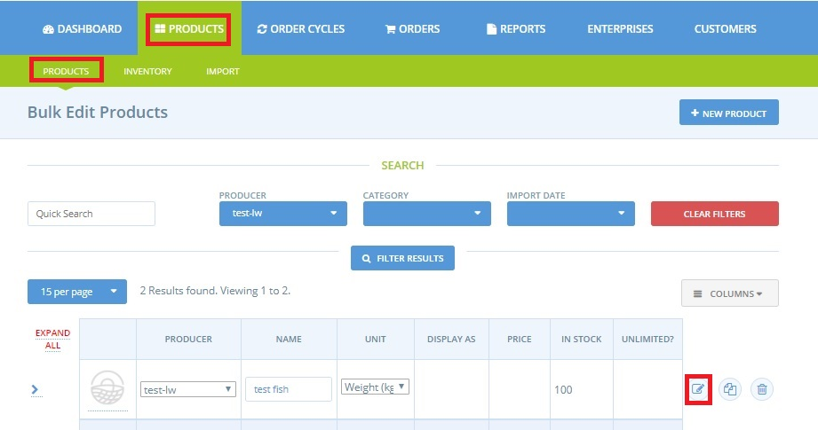
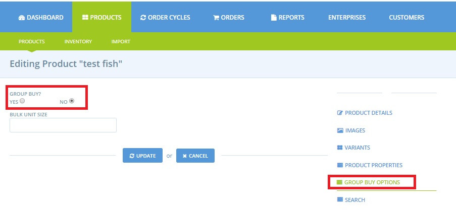
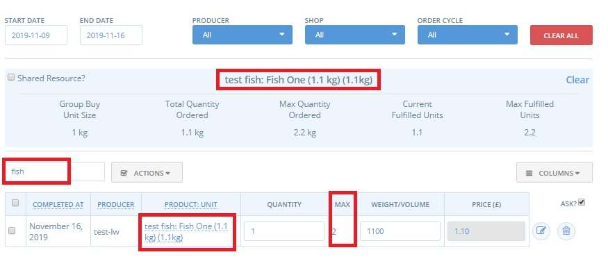

# Group Buy - for bulk ordering

The **Group Buy** function is designed for enterprises who purchase some of their incoming stock in bulk quantities and resell them in smaller units \(for example, purchasing a 25 kg bag of rice and retailing to customers per kg\).

Bulk purchasing is a common practice for **buying groups**, who, by buying large volumes, can benefit from wholesale prices in the same way as conventional distributors.  By dong so, members to access food much cheaper than they might be able to from high street retailers. 

For such enterprises, the decision of whether to order a certain product is dependent on whether customers have collectively ordered enough to justify a bulk purchase. This may be due to volume discounts, or delivery fees. The group buy function makes it easier for the hub to achieve bulk buying efficiencies.

When a product is allocated to group buy it will display differently in the shopfront \(see below\), with a double column Min/Max quantity visible:

Customer are asked to indicate:

* Their **minimum** quantity- this is the amount of the product they ideally want.
* Their **maximum** quantity- this is the maximum amount they would be willing to buy.


Essentially this is a way for the customer to say _‘you have my permission to increase my order up to this point, if it means that as a group, we can achieve the bulk order quantity’._


In [Bulk Order Management](../orders/view-orders.md#bulk-order-management) you can view the total minimum and maximum order quantities for the product, from all of your customers. Then you can either raise customer orders, within their acceptable range, to achieve the bulk quantity, or if the maximum order quantity falls short, you can delete all orders for this product.

## Enabling Group Buy for a product

On the admin dashboard, go to '**Products**' on the blue horizontal menu.  Select to **Edit** a product by clicking on the pencil and paper icon to the right of the product in question:

Then select **Group Buy Options** in the menu to the right.

Select **Yes** under **Group Buy? to activate this feature for the product.**

The **Bulk Unit Size** is the amount that the group’s collective order needs to reach. 


The **units** for the Bulk Unit Size quantity depend on the units selected for retailing the product to customers.  

If the product is sold by:

* **Weight**: units are in g \(so if collective total must equal 5 kg then enter '5000' in this field\)
* **Volume**: units are in litres \(so if collective total must be 10 l then enter '10' in this field\)
* **Items**: eg. selling bunches of flowers but must purchase 100 bunches in total then enter '100' in this field.


## Adjusting Orders to make complete Batches

Under Orders-&gt; [bulk order management](../orders/view-orders.md#bulk-order-management) you can view and edit customer orders for Bulk Buy products to make the combined order from all customers reach your required threshold.

1. Select the order cycle or date range of interest.
2. Search for the product \(Fish in the example below\).
3. Make sure the ‘Max’ column is displayed so you can see the upper limit each customers is prepared to purchase.
4. Next, click on the value \('test fish: Fish One' in the example below\) in the **Product : Unit** column, to display the orders total box \(in blue\) for the product in question. 
5. Using the information in the column **Max**, you can increase the quantities ordered to reach the threshold for a complete batch. 
6. Click update to save changes to customer orders.

**Current Fulfilled Units** divides your total quantity ordered by the group buy unit size. If this figure is greater than 1, it tells you that the existing customer order satisfy or exceed your required group buy unit size. If this figure is less than 1, existing customer orders don’t meet that threshold. As you raise the quantity of customer orders, this figure will raise.

**Max Fulfilled Units** takes the sum or all of the customer’s MAX order quantities and divides this by the Group Buy Unit Size. If the number is over 1, then you know that the total of your MAX orders exceeds the required group buy quantity. If it’s below zero, it means that even the MAX order quantities won’t reach the threshold.

