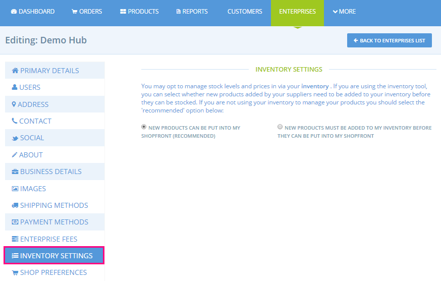
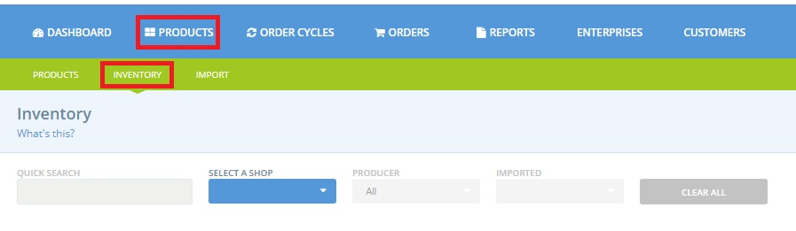
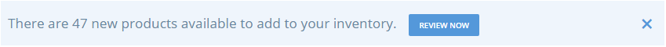
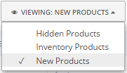
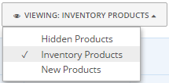
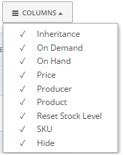
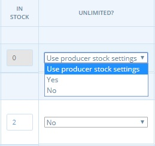
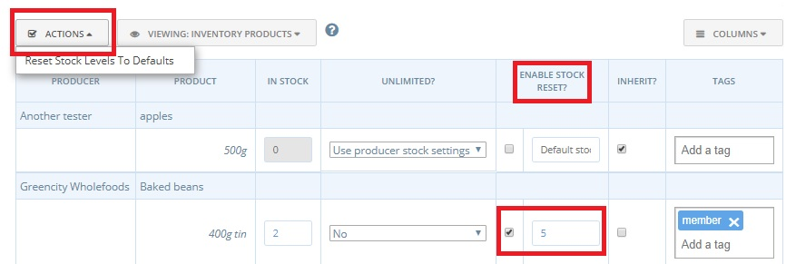
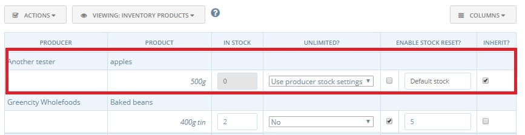
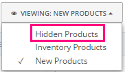

# Inventory tool

## Introduction

The 'inventory' gives enterprises increased control and flexibility with their product management, if they require it. The feature will mainly be of interest to Hubs and Hub managers.

By using the 'Inventory' Hub A can modify the price and stock levels of the items it has permission to retail.  The feature can also allow Hub A to make only a sub-selection of goods from its supplying producers available for sale on its shop front if they don't wish to distribute entire product ranges.  All this can be done without modifying the master copy of the products. Hence if both Hubs A and B stock the same products, then by using the inventory tool Hub A can alter price and other fundamental information about the items it sells without impacting on Hub B.

## Profile settings for the Inventory

To access the Inventory, go to Entreprises \(on the blue horizontal menu\) and then 'Settings'. From the menu bar on the left hand side, select 'Inventory Settings'

You have two options: 

* **New products can be put into my shopfront \(recommended\):** Your supplier's products can be added to your online shop-front _without you having to add them in your shop/hub inventory beforehand_. When you create an order cycle, _all_ products from the selected producers will be available for you to add to the 'incoming' portion of it \(the order cycle\).  This is the default option and is recommended for hubs who do not wish to modify price or stock levels of the items they retail


BE CAREFUL- if you keep your inventory settings in this default 'off' mode but at the same time upload products to your hub inventory and modify their prices or stock levels, then the modified information will be displayed on your shop front, not that in the master copy.


* **New products must be added to my inventory before they can be added to my shopfront:** When you create an order cycle, only those products which you previously added to the hub inventory will be visible for selection in the 'incoming' portion of the order cycle.

## Visiting your Shop/Hub Inventory 

Click the Products menu on the top of your the admin dashboard, and then click Inventory in the green sub menu. If you manage multiple enterprises, you will be asked to select one because each inventory is managed independently.

If new products have been added by your suppliers between each visit to your shop/hub inventory then you will see the following message:

Until you have added these products to the inventory they will remain in the '**New Products**' category and invisible for selection when creating an order cycle. By clicking on '**Review Now**' you will be redirected to the list of new products. 

## Reviewing New Products

New products can be either **Added** to your inventory list or **Hidden**. If there is a product in the list for which you would like to override details, or apply a recurring stock level to, you’ll need to **add** it to your inventory list. If there is a product which you never want to sell in your shop, or at least don’t want to stock in the near future, you can choose to **hide** it \(see **Hidden Products** section below\).


Remember, if your **Inventory Settings** are set so that ‘new products must be added to my inventory before they can be put in my shopfront’, any products you leave in the New Product list will effectively be hidden. If your Inventory setting is ‘new products can be put in my shopfront’ then products in your New Products list will still show in your order cycle.


## Managing Your Inventory Products

Your inventory products list is where you can override product details, set up stock level resetting, and hide products. 

Via the columns button on the right of the table, you can choose which settings you would like to see and modify.

### Modify SKU, prices and stock levels for products in your shopfront

Any changes you make here will be visible on your shop and will hence override details set by the supplier. You can modify the following fields: 

* **SKU** – if you wish to use an alternative SKU \(reference number\) for a product, you can over-ride the producer’s SKU here by typing in an alternative.
* **Price** – You can set a different price to show in your shop. Keep in mind the units of the product will remain the same. Hence if the product is priced per kg then you can only modify its cost per kg and not change it to a fixed cost per item.
* **In Stock** – If your stock of this product differs from the available stock offered by the producers, you can indicate your stock. Your products will no longer be visible in the shop once the inventory stock level reaches zero.


This might be handy if you receive a bulk purchase of say 50 items per month and need to keep track of their sales before the next delivery. 


* **Unlimited?** – You can select whether to inherit producer stock levels \(in which case the number in the 'in stock' column will remain grey\), to have unlimited stock 'yes' \(hence the item will never run out and will always be available, if added to an active order cycle\) or to define your own stock levels 'no' \(in which case the number in the 'in stock' column will be on a white background\).

Refresh yourself about 'in stock' and 'unlimited' [here](products.md#adding-products).


It is not possible to alter product name, properties, description or image.


### Enable Stock Reset?

The **enable stock level reset** column allows you to reset the 'In Stock' amount to a default value, ****for example at the start of each new order cycle. The **default amount** is the number entered in this column next to the check box. The checkbox allows you to select only those items that you want to reset at any give time. 

To reset the default stock for these products, click 'Actions' at the top left of the inventory table and then 'Reset stock levels to defaults'. Only products for which the enable stock reset box has been checked will be affected by this action. 

> In this example the default stock level of baked beans is 5. There are currently 2 left in stock. If the user, at the beginning of an order cycle wishes to reset to 5 then they must click on 'Reset stock levels to defaults' under 'Actions'


This is a useful feature for hubs who may receive deliveries of specific products once a month or on a regular schedule. 


### Inherit?

If you have not changed any of the values in the Inventory table for a product, the check box "inherit?" will be, by default, checked. This means that the information entered by the producer and visible in grey will be displayed on your shopfront.

By modifying one or more of the fields, this check box will be automatically de-selected. To reset values \(price, stock, SKU etc\) to the producer's master copy values, you can re-select this box at any time.

### Hide

As in the **New Products** list, you can also **hide** products from your **Inventory List**. Clicking on the hide button will move the product to your **Hidden Products** list. If you have your inventory profile set up as '**New products must be added to my inventory before they can be added to my shopfront'** \(see [here](inventory-tool.md#profile-settings-for-the-inventory)\) then the product you just hid will no longer be available for selection in your hub's order cycle and thus will not be visible on your shopfront.

## Hidden Products

This is a list of all the products you have chosen to hide:

When viewing your list of hidden products you can choose to make them visible once more by clicking the '**Add**' button to the right of the item.

## Inventory and Order Cycles

When setting up order cycles you can on a case by case basis choose between selecting from all available products or only those which are in your shop/hub inventory. 

This is controlled by visiting 'Advanced Settings' \(top right of order cycle page\):

This option has the same effect as changing our enterprise [profile settings for your inventory](inventory-tool.md#profile-settings-for-the-inventory), but unlike the latter it applies only to the order cycle in question.


After making any changes always remember to click 'Update' or 'Save' before moving on!


