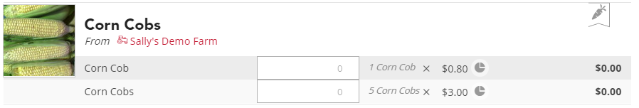
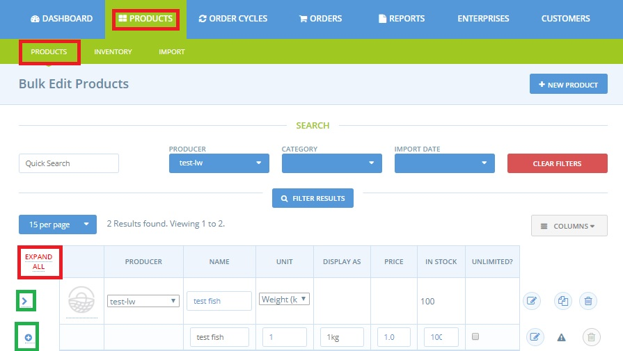
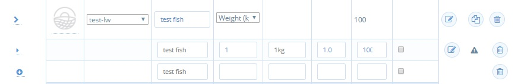

# Product variants

If you are listing two or more products which are very similar, but only vary on price, or size, or something like flavour, it is best to create a ‘variant’ for that product, rather than creating multiple, separate products. This will make the listing clearer to customers and prevent your store from becoming cluttered.

## How do I create a Product Variant? 

First of all, it is necessary to create a product, which will automatically be also the first variant of this product. For more details on adding simple products, click [here](products.md). 

In your admin dashboard, go to the products page where you will find the list of products for companies of "producer" nature that you manage. To see **all the variants** associated with your products, click on "Expand All" in red at the top left of the table.

To see see the variants of a specific product only, click on the angle "&gt;" to the left of the first column of the table. If you wish to create a new variant for this product, click on the small plus "+" which is displayed just below as shown above.

This will add a new line allowing you to quickly enter information about the second variant:

The first line corresponds to the 'parent product' which will be offered for sale to customers in the form of several variants. Some product-level information will therefore apply to all variants, such as the unit of measure, the name of the unit if the product is sold individually, the properties, the conditions of transport, etc. 

The 2nd and 3rd lines are here the 2 variants of the product. Each variant is distinguished from the others by at least one differentiating element, such as the unit \(eg. packaging per 500g instead of 100g for the first variant\) and, very often, the associated price.  Slight variations in the nature of a product \(eg. flavour\) can be detailed by changing the name of each variant \(eg. variant one has name = 'goats cheese- herbs' and variant two has name=  'goats cheese- garlic'\). 


To avoid errors when reading reports, we strongly recommend that you always name each variant differently.



At the moment, stock levels can only be defined **at the level of the variant.**

We know this might be a problem if you have a fixed amount of an item but wish to retail in bulk quantities as well as singularly. \(eg if you have only 5 kg of tomatoes in total but wish to sell as variants of  100 g and 1 kg you will have to manage your stock levels between the two variants manually.\)



There is no maximum number of variants for a product. You can add as many as you need.



When you are finished always select 'save changes' in the red box at the bottom right of the screen.


