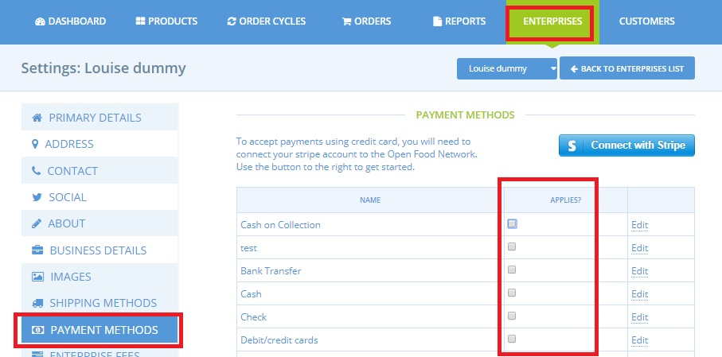
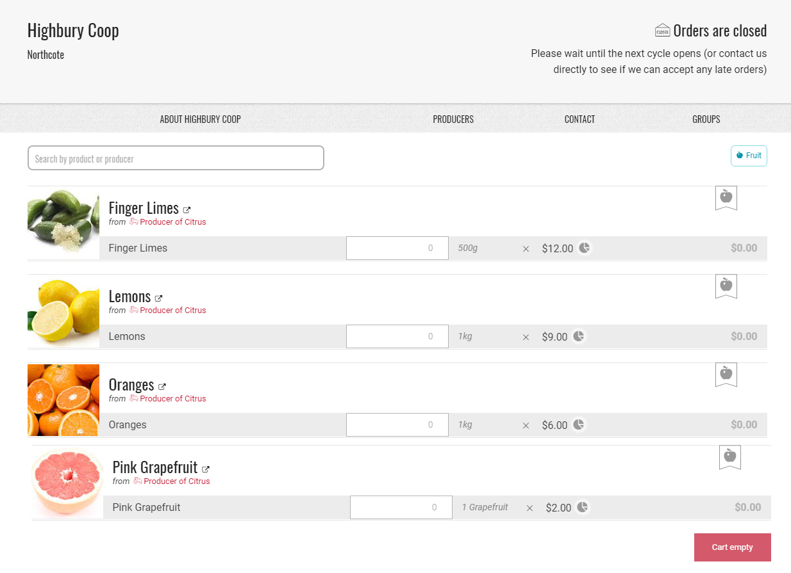

# Display only shopfront

In some cases, shop owners may want to be able to display products in their shop but not actually allow customers to checkout. For example to show their full product range \(which may vary seasonally\), or to give potential customers an idea of the products which will be on offer in the next order cycle, before it opens.

To setup a display only order cycle:

* Open an [Order Cycle](order-cycle/order-cycles-for-hubs.md) as usual, with the products you wish to display and date range for the order cycle to remain open.
* Deactivate all your [Payment Methods](payment-methods.md)- this can be done from Enterprises -&gt; Settings -&gt; Payment Methods and then un-checking all options:

Your shop will now be in the ‘display only’ state.   
Below is an example of how the shop appears to customers. It’s clearly marked as closed, but customers can see the product range. If they do try to add items to cart or checkout, they’ll be stopped.


When you next open a live order cycle from which you wish to sell produce, you will need to reactivate at least one payment method.



In order to create the order cycle for your 'display only' shop front you will need to have at least one Payment Method active else the order cycle will not work.  It is **only after it has been set up** that you must deactivate the Payment methods in order to create a display only shop front.


