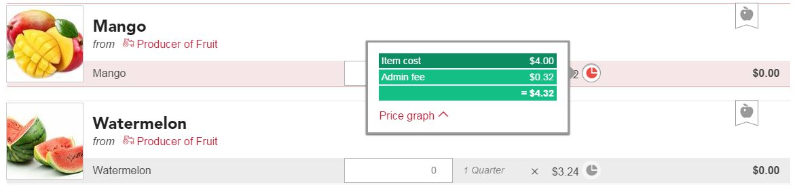
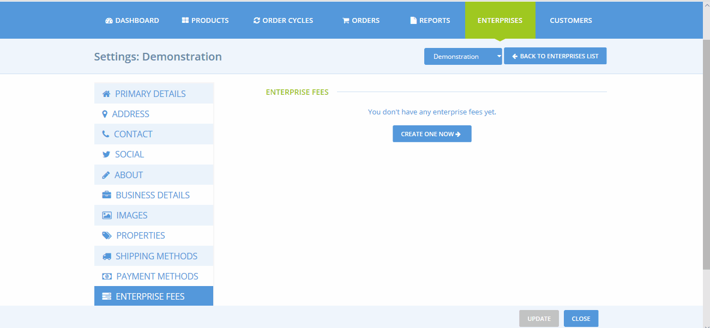
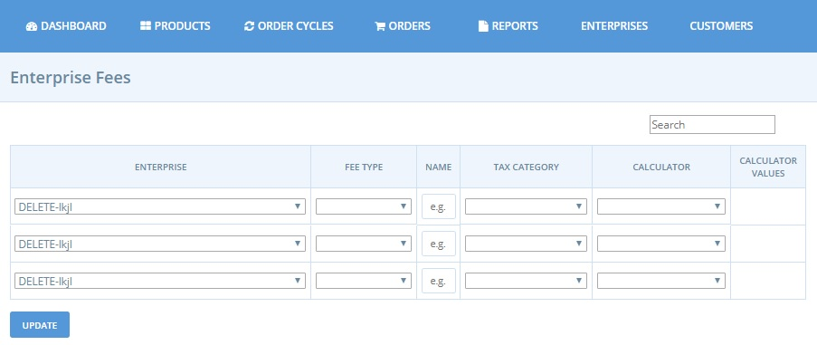
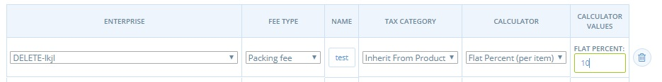
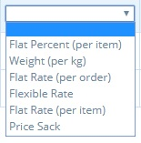
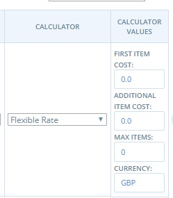
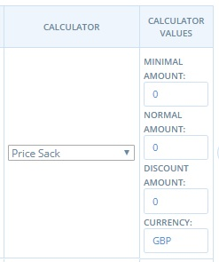

# Enterprise Fees

Enterprise fees are useful for producers and hubs who are working together: it allows costs associate with admin, packing, transport, sales and fundraising to be allocated to different parties.

For example a hub may choose to add an enterprise fee of 10% to all the products they sell, to cover their administration costs \(storage of products prior to distribution, salaries of people who manage and coordinate sales...\)

For producers selling their own products directly, these costs are already present in the price of the product, so applying Enterprise Fees may not seem necessary. 

One of the many benefits to Harvest To Order customers is price transparency.  Shoppers can see the percentage of an item's price assigned to admin, packing etc.  This information is displayed by clicking on the pie chart next to the price of a product on the shop front:

Before you move on you might like to have a look at a quick demonstration of setting up your first enterprise fee:

## Setting up an Enterprise Fee

* Go to the Enterprise Fee page by clicking on **Enterprises** in the blue horizontal menu, and then click **Settings** next to your enterprise. The **Enterprise Fee** page is found in the menu on the left hand side.
* Click **Create one now**  \(or **Manage Enterprise Fees** if you have already set one up and would like to edit it\). You will be directed to a page like this:

**Enterprise:** In the first column, select the enterprise to which the fee applies.

**Fee Type:** Select the service that this fee applied to.  The options are Packing Fee,  Transport Fee, Admin Fee, Sales Fee or Fundraising Fee.

**Name:** Choose a name for this fee.

**Tax Category:** Select the appropriate tax rate.  In most cases the VAT rate for the enterprise fee will be inherited from the product.  If the enterprise fee is associated with a service added to the product the fee may be subject to VAT but the product itself not. In which case choose between 'Zero rated', 'Full Rate' and 'Reduced Rate' of VAT to applied to Enterprise fees.

**Calculator:** The fee can be calculated in a number of ways. Select the calculator which best applies.

Click Update, to create the enterprise fee. 


You will only be able to specify rates or values \(in the 'calculator values' column after the Enterprise Fee has been created.


## Fee Calculators

**Flat Percent** – This fee is charged as a percentage of the total amount charged in the order.

**Weight \(per kg\)** – this fee is applied to products on a per kg basis. The fee will _only be applied to products which are priced at a per kg rate_, not products listed as items \(e.g. A product listed as ‘1 bunch of parsley’ will not have an associated enterprise fee with this option.\)

**Flat Rate \(per order\)** – This fee is applied as standard fee to all orders, regardless of the size of the order.

**Flexible Rate** – This fee calculator is especially useful if you'd like to encourage customers to place large orders: the enterprise can be reduced or zero when the threshold number of items has been reached. 

* ‘First Item Cost’: The fee charged for the first item in the order.
* ‘Additional Item Cost’: The fee charged for items beyond the first item.
* ‘Max Items’: The maximum number of items on which the fee will be applied. Items purchased beyond this amount will be not be charged the fee.

> For Example: if the 'First Item Cost' is set to £0.20, 'Additional Item Cost' is £0.10 and 'Max Items' is 3 then a customer who purchases 5 items will be charged £0.40 in enterprise fees \(£0.20 for the first item, £0.10 for items two and three, and £0.00 for items four and five\).

**Flat Rate \(per item\):** This fee is a constant fee, applied to products listed as ‘items’. \(It is not applied to products sold by weight or volume. Hence there will be no associated enterprise fee charged to a customer who, for example, buys rice by kg.\)

**Price Sack:** This is a flexible enterprise fee method charged by _total monetary sale_, rather than number of items purchased \(Flexible Rate above\)

* ‘Minimum Amount’: Monetary value of the threshold between Normal Enterprise fee and Discounted Enterprise fee. 
* 'Normal Amount': Payment Method fee applied to sales below the threshold stated in 'Minimum Amount'.
* ‘Discount Amount’: Payment Method fee applied to sales above the threshold stated in 'Minimum Amount'.


Now that you've created your Enterprise Fee remember that **it will not apply in your shop unless it's added to an order cycle**. See the order cycle pages for [producers](order-cycle/order-cycles-for-producers.md) or [hubs ](order-cycle/order-cycles-for-hubs.md)for more details.


