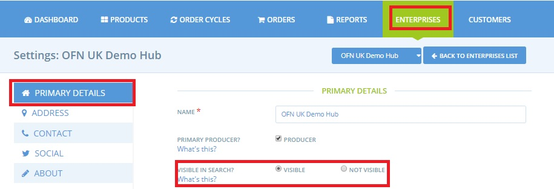
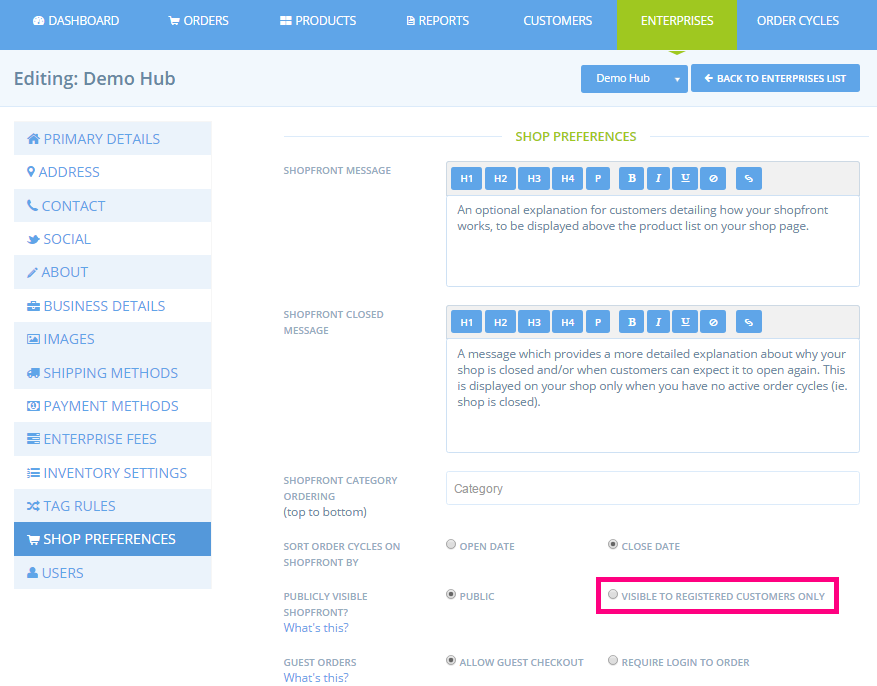
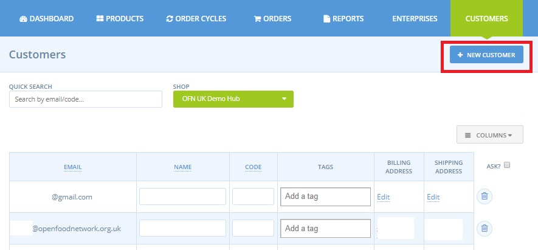
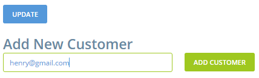
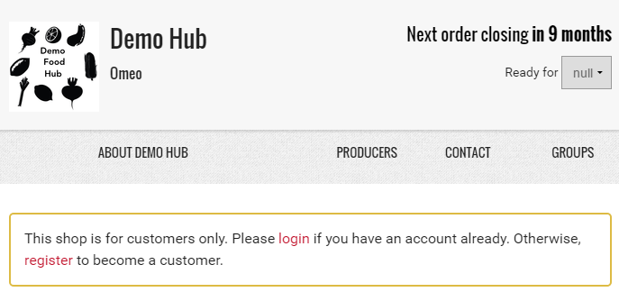

# Private shopfront

If you don’t want your shopfront to be visible to the public \(ie. you would like to host a shop front from which only members can place orders\), there are two ways that you can make your shop more private:

* make you shop 'Invisible' and only share the shop website address \(URL\) with your desired customer base
* make your shop 'private' and only visible to registered customers.

## Make your shop front invisible

In your [Enterprise Settings](../enterprise-profile/enterprise-settings.md), under Primary Details, you can set your profile to 'invisible'. 

When the **Visible in Search?** option is set to 'not visible' your Harvest To Order enterprise will be hidden in both all searches within the platform and in external web the search engines.   
Your enterprise will not appear in the "shops" menu nor on the Harvest To Order map page. 

The benefit of this method for making your Harvest To Order shop front invisible is that you can invite \(by email, perhaps\), customers by sending them the direct link to the store.  It is also a simple and effective way to manage your enterprise.


However, _**access to the store is not restricted:**_ anyone who knows the website address of your shop \(URL\) will be able to visit the shop and place an order.  


Hence, if someone on your mailing list forwards an email from you to a friend, the friend can place an order without being a registered customer.  You will need to manually double check that all orders came from registered customers, posteroiri.

## Visible to registered customers only

A stricter, but potentially more time consuming approach, is to let your Harvest To Order enterprise remain visible in the enterprise settings above but change the **Publicly Visible Shopfront** option \(under Enterprises-&gt; Settings-&gt; Shop Preferences\) to **Visible to Registered Customers Only**.

Whilst your enterprise will be visible in a search of the Harvest To Order platform, your customers would need to log into their Harvest To Order account in order to view your shop front and the products on offer.  Other registered Harvest To Order shoppers, who are not on your customer list, will not be able to see your shop front once logged into their Harvest To Order accounts.

You'll need to maintain your [**Customer** ](customer-management-and-conditional-displays-prices/customers.md)list and manually add all new customers, before they can place their first order.

You can also delete customers who you no longer want to be able to see your shop or place an order.

### How does the shopping experience change when your shop is private?

When visitors to your shop arrive at the shop, if they're not logged in yet, they'll see the message below.

From here there's 2 pathways:

a\) If the customer logs in, or signs up with an email address that is on the shop's customer list, they'll be taken to the shopfront as usual.

b\) If the customer logs in or signs up with an email that is not on the shop's customer list they'll see the message below. They can then contact the shop to request access.

