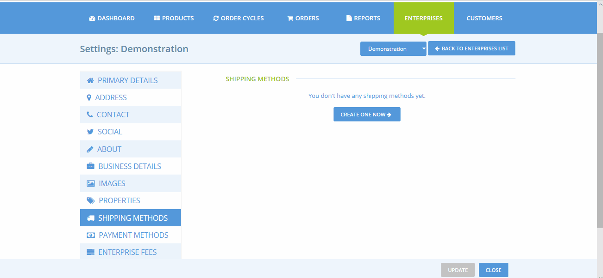
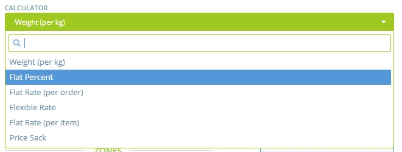
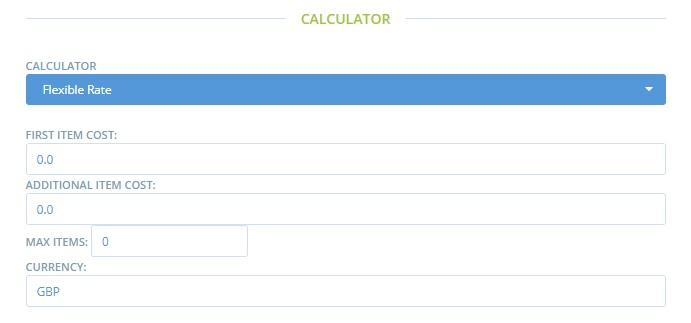
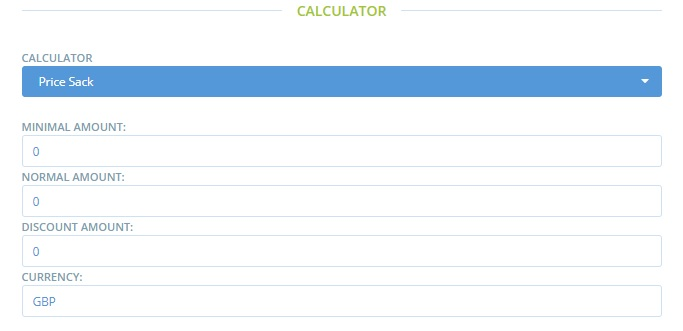

# Shipping Methods


 You **must** create at least one shipping method before you can open your shop.


Before you read on, you might like to have look at a quick demonstration of how to set up your first shipping method:

## Setting up a shipping method

* Go to the Shipping Methods page by clicking on **Enterprises** in the blue horizontal menu, and then click **Settings** next to your enterprise. The **Shipping Methods** page is found in the menu on the left hand side.
* Click **Create new shipping method +** . You will be directed to a page like this:

* Check the box next to your enterprise on the right hand side of the page under 'Hubs'. This indicates that the shipping method you are about to create will apply to that enterprise.  You can select multiple enterprises, if desired.
* **Name**: Choose a name for the method. This name will be displayed to the customer during their purchase process and on order confirmation emails. Example:

* **Description:** Add additional details, such as the precise address of the collection point. These details will be visible to customers in grey next to the name \(see screenshot above\).
* **Category:** Is this method a delivery or pick-up?
* **Tags:** enter labels here if you wish to differentiate between customers. Tags could be useful if you want to offer free shipping to a sub set of customers or only offer delivery to those who have a registered address which is close by.  Read more [here](customer-management-and-conditional-displays-prices/).
* **Calculator:** Select the way that shipping fees will be added to this shipping method.  Note that a shipping fee may be zero. See below for more details.
* **Categories:** Transport conditions \(refrigeration, frozen, default\) associated with this shipping method.
* **Zones:** Select the appropriate zone \(this is to enable correct tax calculations\).

By clicking **Create,** the shipping method will be created, and you will then be provided with new fields, to add details of the shipping method charges. The fields presented will depend upon which shipping fee calculator you have selected. 


If you change the calculator type for a shipping method, you must **save first** before you can edit the calculator settings.


## Fee Calculators

**Weight \(per kg\)** – this fee is applied to products on a per kg basis. The fee will _only be applied to products which are priced at a per kg rate_, not products listed as items \(e.g. A product listed as ‘1 bunch of parsley’ will not contribute to the overall fee a customer is charged for shipping\)

**Flat Percent** – This fee is charged as a percentage of the total amount spent in the order.

**Flat Rate \(per order\)** – This fee is applied as standard fee to all orders, regardless of the size of the order.

**Flexible Rate** – This fee calculator is especially useful if you'd like to encourage customers to place large orders: the cost of shipping can be reduced or zero when the threshold number of items has been reached. 

* ‘First Item Cost’: The fee charged for the first item in the order.
* ‘Additional Item Cost’: The fee charged for items beyond the first item.
* ‘Max Items’: The maximum number of items on which the fee will be applied. Items purchased beyond this amount will be not be charged the fee.

> For example: If the shipping fee for the 'First item cost' is £2, 'Additional Item Cost' = £1 and 'Max items' = 3.   
> A customer who purchases 5 items, will be charged £4 shipping \(£2 for the first item, £1 for items two and three, and £0 for items four and five\).

**Flat Rate \(per item\)** – This fee is a constant fee, applied to products listed as ‘items’. \(It is not applied to products sold by weight or volume. Hence there will be no associated shipping cost charged to a customer who, for example, buys rice by kg\).

**Price Sack** – This is a flexible shipping fee method charged by _total monetary sale_, rather than number of items purchased \(Flexible Rate above\)

* ‘Minimum Amount’: Monetary value of the threshold between Normal shipping fee and Discounted shipping fee. 
* 'Normal Amount': Shipping fee applied to sales below the threshold stated in 'Minimum Amount'.
* ‘Discount Amount’: Shipping fee applied to sales above the threshold stated in 'Minimum Amount'.

