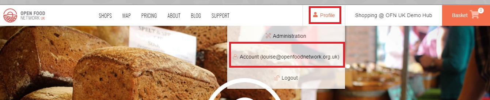
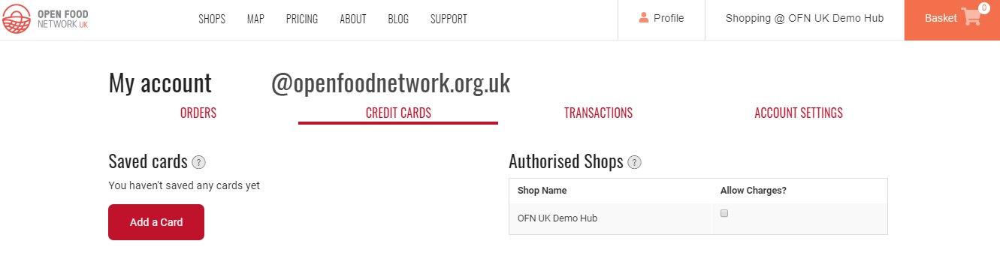

# Subscriptions - the customer's perspective

This page details what a customer with a subscription can expect. It also highlights some things that shops offering subscriptions should be aware of.

## Signing up to Harvest To Order

Customers must have an account with Harvest To Order before you can process subscription orders for them.

To create an account, direct the customer to the local Harvest To Order home page and 'Login' at the top right hand corner.  They'll be guided through registering with Harvest To Order. _**Customers must have an active email address to register**_.

After signing up they'll be sent a confirmation email. Once they click on the link in this email their account will be confirmed and they will be able to login. 


Due to over zealous email filters \(designed to ward off spam\) sometimes customers won't receive their confirmation email from us \(or it will be directed to their junk folder\).  If this occurs ask them to add Harvest To Order to their 'safe' list in their email account settings.


## Saving credit cards and authorising charges

Customer who want to pay for their subscription orders via automated charges onto their credit/debit card \(Stripe\) need to a\) save their preferred card in their Harvest To Order account and b\) grant the shop permission to charge that card. 

### Saving credit card details in the customer account

The Customer's Account page can be accessed after logging into Harvest To Order by the top right hand 'Profile' button:

Your customer can save one or more cards in their account, in the **credit cards** tab.

If a customer registers more than one debit/credit card, then the card which is denoted as 'default' will be the one which is charged automatically by Stripe \(if they have a subscription with Stripe as the chosen payment method\). 


If none of their cards are selected as 'default' their credit card payments won't be processed.


If your customer saves credit cards in their account, they'll also be able to quickly select these when they shop in your shop at checkout.

### **Authorising a shop to charge their default card**

**You should add your customers to your** [**Customer List**](../shopfront/customer-management-and-conditional-displays-prices/customers.md) **before you ask them to save their credit card details and authorise your shop to bill their card. The customer will not see your enterprise under the 'Authorised Shops' list on the right if you have not done so.**

For the Stripe payment method to work for a subscription the customer has with your enterprise they must check the 'Allow Charges' box:

