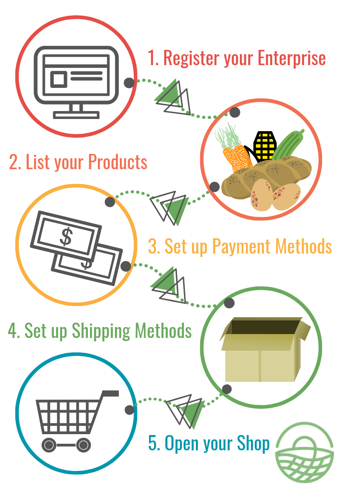

# Shop

It's easy to get started on Harvest To Order, just follow the steps below:

1. [Register your enterprise](../basic-features/register-and-create-your-profile.md).  Choose the 'Producer' and then 'Shop' [package types ](../basic-features/enterprise-profile/package-types.md)and complete your [enterprise settings](../basic-features/enterprise-profile/enterprise-settings.md) with your business details.
2. List your [products](../basic-features/products-1/products.md).
3. Set up a choice of [payment methods](../basic-features/shopfront/payment-methods.md) available to your customers  \(cash on delivery, credit card online payment, etc.\)
4. Set up a choice of [shipping options](../basic-features/shopfront/shipping-methods.md) available to your customers  \('click and collect' service with a pick up time and location, home delivery, ...\)
5. Set up an [order cycle](../basic-features/shopfront/order-cycle/order-cycles-for-producers.md) : this will open your shop at the start date you defined!

Congrats!  Your shop is now live!

When you start receiving orders, you can manage them in the[ orders](../basic-features/orders/) section.  

All the data you need to prepare and deliver the groceries to your customers can be found in the [reports](../basic-features/reports.md) section.

## More advanced features you might need

* Your enterprise profile:
  * On top of selling your products, you want to allow another seller using the Harvest To Order \(a local Harvest To Order hub\) to display your products in their shopfront? [Give them permission to sell your products](../basic-features/enterprise-profile/create-or-connect-with-your-supplying-producers.md).
* Your products: 
  * Specify special [credentials](../basic-features/products-1/product-properties.md) they may have have \(eg. organic, plastic free...\)
  * If you have a product which can be sold in different forms \(eg. potatoes sold in 500g, 1kg and 2 kg quantities\) then you can simplify your listings by adding [variants](../basic-features/products-1/product-variants.md).
  * If you sell irregular items like meat or vegetables \(eg. a whole chicken, a large pumpkin\) which are priced by weight then you can learn [how to do this here.](../basic-features/products-1/pricing-irregular-items-kg.md)
  * You can [import](../basic-features/products-1/product-and-inventory-import.md#1-import-new-products) your all your product listings at once if they are in an Excel spread sheet.
* Your shopfront:
  * You can [restrict access](../basic-features/shopfront/private-shopfront.md) to your shop if want your shop to be only accessible to "members" or invited customer.   For example you may offer discounted produce to members of the community who have all contributed to your business, or if you wished to only sell to specific commercial customers.
  * You can offer different prices, or display different goods, to specific groups of customers using [customer grouping \(through "tags"\)](../basic-features/shopfront/customer-management-and-conditional-displays-prices/tags-and-tag-rules.md) and [custom display and pricing](../basic-features/shopfront/customer-management-and-conditional-displays-prices/).
  * If you would like to be visible on Harvest To Order only but not actually sell goods through the platform then you can setup a [display only shopfront](../basic-features/shopfront/display-only-order-cycles.md).
  * You would like to [embed](../basic-features/shopfront/embedded-shopfront.md) the Harvest To Order shop front in your website.

