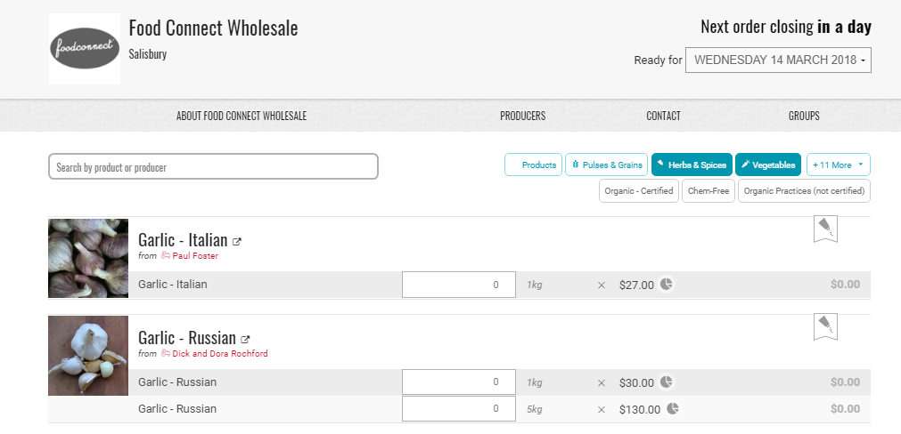

# Hub \(Shop\)

## What is a hub shop?

Hub shops can take many different forms, but at their essence, they are an online shop which stocks products from multiple source-identified supplying producers. With a hub shop customers can see profiles of the producers who grew/raised/baked their food.

Some examples of food hubs include wholesale and retail food hubs and dry goods buying clubs.

## What does it do?

**A shopping experience customers will enjoy**  
With a hub shop customers can see profiles of the producers who grew/raised/baked their food, giving them a virtual farmer's market experience.

**Streamline your admin tasks**  
Unlike taking orders with emails, texts or phone messages, taking orders online is simple and time saving. Use Harvest To Order's reports to understand your stock levels, your sales, your orders and your packing sheets, all at a glance.

**Take orders periodically**  
You can choose when your shop opens and closes, and run your shop in cycles.

**Involve your suppliers**  
Your suppliers can login directly to Harvest To Order to update their product availability and prices, minimising some administration tasks for you.

**Be flexible**  
Our software is designed to be flexible and to accommodate business models of all different shapes and forms. You can use our flexibility to experiment with new ways of doing things. If you want to experiment supplying to hospitality customers, you can setup 'hospitality only' shops. Want to experiment with a new delivery location, add a drop-off point. Want to experiment with adding a second delivery date, you can do that.

## Steps for setting up a Hub Shop

1\) [Register your profile](../basic-features/register-and-create-your-profile.md) on Harvest To Order. This setup tool will ask for basic information about your enterprise to create your profile. You'll be prompted to confirm your email address.

2\) Select the 'hub shop' [package type](../basic-features/package-types.md).

3\) If you want to edit your profile, or add further detail you can modify your [Enterprise Settings](../basic-features/enterprise-settings.md). Here you can also chose whether your shop is open to the public or private and write a shopfront message.

4\) Define and setup your [shipping methods](../basic-features/shipping-methods.md).

5\) Define and setup your [payment methods](../basic-features/payment-methods.md).

6\) Define any [enterprise fees](../basic-features/enterprise-fees.md) you want to apply in your shop.

7\) [Create profiles for, or connect with your supplying producers](../basic-features/create-or-connect-with-your-supplying-producers.md). You need to do this before you can add your product range.

8\) Manage your products

The following instructions for managing products are broken down according to what you setup in step 7 above, either you a\) created a profile for your supplying producer; or b\) connected with a pre-existing supplying producer profile.

**8a\) I created a profile for my supplying producer**  
If in the previous step you created a profile for your supplier \(because they were not on the Harvest To Order\), you’ll need to also [add their products](../basic-features/products.md) to that profile, before you can stock them in your store.

**8b\) I connected with a pre-existing supplying producer profile.**  
If your supplying producer already had a profile, you may or may not need to add their product range. If that producer has already added their products, you don’t need to add them again, instead you just need to get their permission to stock their products in your shop \(see previous step 7\). They’ll then be visible to your when you go to stock your shop \(in order cycles\).

If your supplying producer has a profile, but hasn’t added their product range, you’ll need to first get their permission to manage their products and stock them in your shop. Then, you can [add their products](../basic-features/products.md).

**Once you've setup your shipping and payment methods, and added your products, you can open your shopfront**    
8\) Open your shop by opening an [order cycle](../basic-features/order-cycles-for-hubs.md).

**Once you've received orders in your shop, you can see orders and use the reports.**    
  
9\) View and edit [orders](../advanced-features/orders/).

10\) [View reports](../basic-features/reports.md). You may use the reports to generate packing sheets, invoices and or mailing lists.

## Advanced features that are helpful for hubs with shops.

* [Embedding your shop](../advanced-features/shop-setup/embedded-shopfront.md) into your own website.
* [Pricing irregular items](../advanced-features/products/pricing-irregular-items-kg.md) such as meat
* [Opening more than one order cycle](../advanced-features/order-cycles/opening-more-than-one-order-cycle.md).
* [Group Buy](../advanced-features/products/group-buy-for-bulk-ordering.md) is a tool to help buying groups make bulk purchase decisions

