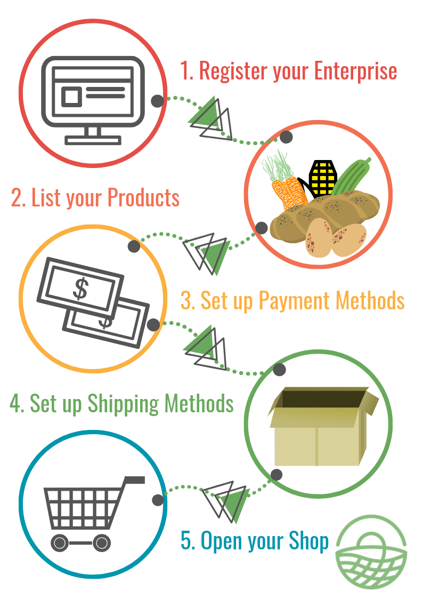

# Hub

It's easy to get started on OFN, just follow the steps below:

1. [Register your enterprise](../basic-features/register-and-create-your-profile.md).  If you wish to sell goods that you make as well as those of others then choose the 'Producer' and then 'Hub' [package types](../basic-features/enterprise-profile/package-types.md); whereas, if you only want to sell good made by others then choose the 'Non-Producer' and 'Hub' package options. Complete your [enterprise settings](../basic-features/enterprise-profile/enterprise-settings.md) with your business details.
2. List your products.  If you are a 'Producer Hub' then [make](../basic-features/products-1/products.md) \(or [import](../basic-features/products-1/product-and-inventory-import.md#1-import-new-products)\) product listings for the goods you make yourself. For both 'Producer' and 'Non-Producer' hubs, contact local OFN enterprises who want their goods to be displayed on your shop front.  Ask them to set up [Enterprise permissions](../basic-features/enterprise-profile/enterprise-to-enterprise-permissions-e2es.md) to connect to their business to yours through OFN.
3. Set up a choice of [payment methods](../basic-features/shopfront/payment-methods.md) available to your customers  \(cash on delivery, credit card online payment, etc.\)
4. Set up a choice of [shipping options](../basic-features/shopfront/shipping-methods.md) available to your customers  \('click and collect' service with a pick up time and location, home delivery, etc...\)
5. Set up an [order cycle](../basic-features/shopfront/order-cycle/order-cycles-for-producers.md) : this will open your shop at the start date you defined!  An order cycle is a period during which shoppers can place orders for collection or delivery at a particular time.  Some enterprises have a weekly order cycle.  Some have a permanently open order cycle.

Congrats!  Your shop is now live!


To earn a little revenue to cover the cost of organising sales you may like to add an '[Enterprise Fee](../basic-features/shopfront/enterprise-fees.md)'- this mark-up is added to the selling price of products on your shopfront.


When you start receiving orders, you can manage them in the [orders](../basic-features/orders/view-orders.md) section.  

All the data you need to prepare and deliver the groceries to your customers can be found in the [reports](../basic-features/reports.md) section.

## More advanced features you might need

* Your enterprise profile:
  * As a **Producer Hub** you can give other local hubs [permission ](../basic-features/enterprise-profile/enterprise-to-enterprise-permissions-e2es.md)to sell your products on their shopfront as well as your own.
  * You may wish to [add hub managers](../basic-features/enterprise-profile/transfer-ownership.md) so that no one person has to do all the admin!
* Your products \(**Producer Hub** only\): 
  * Specify special [credentials](../basic-features/products-1/product-properties.md) they may have have \(eg. organic, plastic free, etc...\)
  * If you have a product which can be sold in different forms \(eg. potatoes sold in 500g, 1kg and 2 kg quantities\) then you can simplify your listings by adding [variants](../basic-features/products-1/product-variants.md).
  * If you sell irregular items like meat or vegetables \(eg. a whole chicken, a large pumpkin\) which are priced by weight then you can learn [how to do this here.](../basic-features/products-1/pricing-irregular-items-kg.md)
  * You can [import](../basic-features/products-1/product-and-inventory-import.md#1-import-new-products) your all your product listings at once if they are in an Excel spread sheet.
* Your shopfront:
  * You can [restrict access](../basic-features/shopfront/private-shopfront.md) to your shop if want your shop to be only accessible to "members" or invited customers.   For example you may offer discounted produce to members of the community who have all contributed to your business, or if you wished to only sell to specific commercial customers.
  * You can offer different prices, or display different goods, to specific groups of customers using [customer grouping \(through "tags"\)](../basic-features/shopfront/customer-management-and-conditional-displays-prices/tags-and-tag-rules.md) and [custom display and pricing]().
  * If you would like to be visible on OFN only but not actually sell goods through the platform then you can setup a [display only shopfront](../basic-features/shopfront/display-only-order-cycles.md).
  * You can [embed](../basic-features/shopfront/embedded-shopfront.md) the OFN shop front in your own website.

