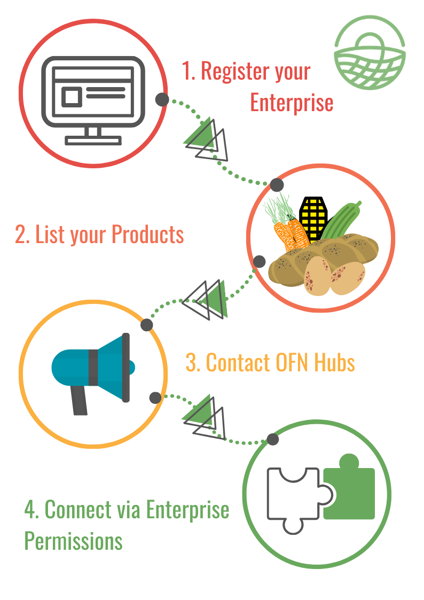

# Profile

It's easy to get started on OFN, just follow the steps below:

1. [Register your enterprise](../basic-features/register-and-create-your-profile.md).  Choose the 'Producer' and then 'Profile' [package types ](../basic-features/enterprise-profile/package-types.md)and complete your [enterprise settings](../basic-features/enterprise-profile/enterprise-settings.md) with your business details.
2. List your [products](../basic-features/products-1/products.md).
3. Get in contact with OFN hubs through which you would like to sell your products- this might be as simple as talking to the hub manager when collecting your shopping or sending them an email.
4. Connect through OFN to the hub where you would like your goods to be sold by setting up the appropriate [enterprise permissions](../basic-features/enterprise-profile/enterprise-to-enterprise-permissions-e2es.md).

Congrats!  Your job is done!  

The hub managing your sales should periodically send you orders based on the time scales you agreed.  Order notifications can be automated by the Hub to get to you by email.


If you want to use OFN to be visible on the internet only then there is no need to complete steps 2-4 above.



You can make your producer profile searchable by product category, even if you don't wish to actually sell goods by following these [steps](../basic-features/enterprise-profile/making-a-producer-profile-searchable-by-product-category.md).


## More advanced features you might need

* Your products: 
  * Specify special [credentials](../basic-features/products-1/product-properties.md) they may have have \(eg. organic, plastic free...\)
  * If you have a product which can be sold in different forms \(eg. potatoes sold in 500g, 1kg and 2 kg quantities\) then you can simplify your listings by adding [variants](../basic-features/products-1/product-variants.md).
  * If you sell irregular items like meat or vegetables \(eg. a whole chicken, a large pumpkin\) which are priced by weight then you can learn [how to do this here.](../basic-features/products-1/pricing-irregular-items-kg.md)
  * You can [import](../basic-features/products-1/product-and-inventory-import.md#1-import-new-products) your all your product listings at once if they are in an Excel spread sheet.

